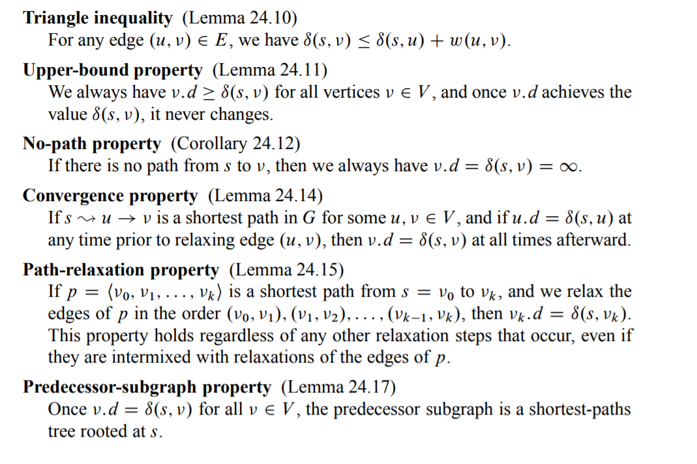
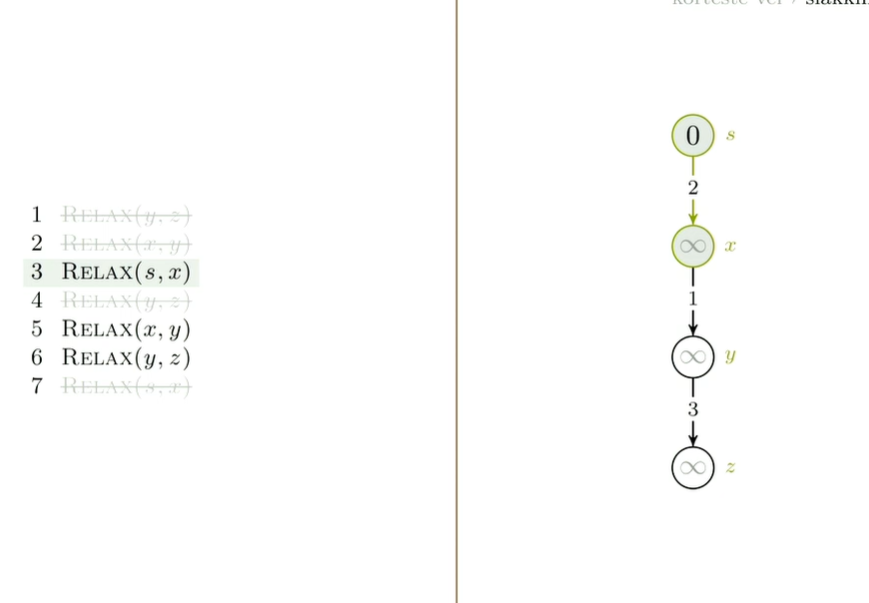
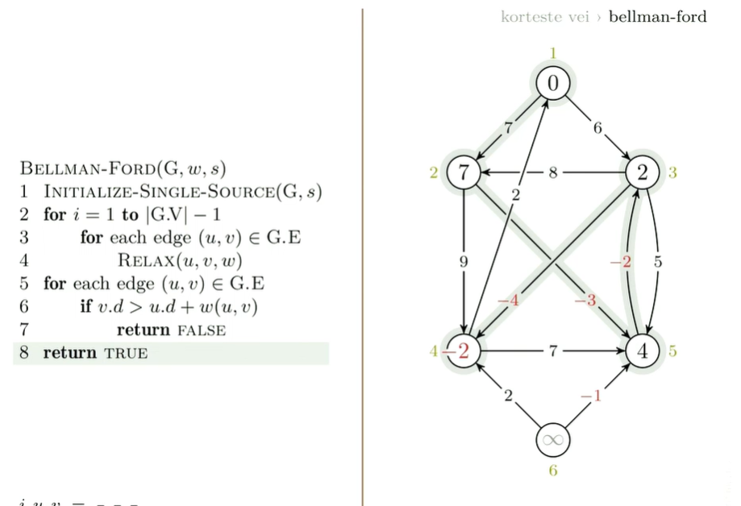

# **Korteste vei fra en til alle** 

# Single-source shortest paths.
These algorithms typically rely on the property that a shortest path between two vertices contains other shorts paths within it. 
Optimal substructure property. Kan derfor bruke både dynamisk programmering og greedy algorithsm(dijkstras). 

Properties of shortest paths and relaxation.

Dijkstra har lavere running time, men kan ikke ha negative kanter.
Bellman-ford kan ha negative kanter og kan detektere negative sykler. 
# Dekomponering

**Bryt ned i mindre instanser av samme problem, anta at vi kan løse dem siden vi løser dem rekursivt og bruk dem til å bygge et trinn i algoritmen.**
Hvis du skjønner det prinsippet har du kommet veldig langt.

**Skal bruke dette prinsippet til å finne kortest vei  i en graf.**

Vi har en start node og vi vil finne korteste vei til en annen node. **Oftest er det enklere å bare finne til alle.** Er en annen måte å se på dekomponering på. Istedenfor å se på en instans og bryte den ned til andre. Tar vi instansen og setter den i en familie med mange instanser og prøver å lage en sammenheng mellom dem så vi kan lage løsninger på hverandre. Lage et regneark med instanser med avhengighet mellom dem. 

**SSSP SINGLE SOURCE SHORTEST PATH: én til alle**

    Vi begynner med å anta en asyklisk graf
    Delproblemene er like nodene. 
    for å finne avstanden til den øverste noden er vi avhengige av å finne avstanden til de nodene under. 

    Vi antar at vi har funnet o(s,-) for inn naboer induktivt. 

    For hver node gå gjennom forgjenger og se om man finner en snarvei. 
    Vi ser på forgjengere. Det vi vil ha er å se på etterkommerne fordi det er lettere å implementere. 

    Summen av størrelsen på grafen som er antall vertex og edges er kjøretiden asymptotisk. 
    
    Det vi kan gjøre er ok du går i startnode. så kjører du rekursjon. Går gjennom alle stiene med 

    den setter alle avstandene til uendelig utenom startnode som får 0 og alle forgjengere til null.

    Når vi har gjort det der med alle innkantene til en node har vi tatt minimum av forgjenger avstanden + kantvektene. Det her er en av dem og det er det vi kaller kantslakking / relax. 

# DAG-Shortest-Path (DIRECTED ASYCLIC GRAPH)

start noden er 2.

> God mental modell for dynamisk
programmering; erkeeksempel
> Delproblemer er avstander fra s til innnaboer; velg den som gir deg best resultat
> Bottom-up: Kantslakking av inn-kanter i
topologisk sortert rekkefølge (såkalt pulling)
> Gir samme svar: Kantslakking av ut-kanter i
topologisk sortert rekkefølge (såkalt reaching)

>Kantslakking er altså en oppspalting av
minimums-operasjonen fra
dekomponeringen. Vi har foreløpig ikke
vært så kreative med hvordan vi har
brukt det – la oss studere teknikken litt
mer i detalj.

# Kantslakking

Vi begynner med uendelig så slakker vi oss nedover. Det går ann å slakke seg helt ned til optimum. Det har vi vist at går ann hvis vi ikke har noen sykler. 

Du tar startnoden sin verdi + kanten sin verdi og legger det i finish noden. 

Hvis start noden sin verdi altså s.d endres så må man slakke kantene.

Hver gang start noden til en kant får endret avstands estimate så veit vi at på et eller annet tidspunkt må vi slakke kanten og da er den første slakkingen bortkasta.
Så vil slakke så få ganger som mulig. 

Hvis den innerste har rett avstandsestimate har de ytterste også rett.

**Sti slakkings egenskapen**

Om p er en kortest vei fra s til v og vi slakker kantene til p i rekkefølge så vil v få riktig avstandsestimate. Uavhengig av hvordan grafen ser ut. Om det skjer andre slakkinger innimellom. Hvis vi først slakker den første så noe annet så den andre så noe annet så noe annet så den tredje osv.. hvis vi er først 1,2,3 så blir v riktig. 

Mange av kallene er bortkasta vi kan fjerne og bare relax de vi må.

## Eks 
## Eksempel på at k-1 ganger er garantert ferdig her er det 3.

Tre pass garantert ferdig. Hvis vi går gjennom alle kantene engang så alle engang til så tredje gang er vi garantert at den er ferdig. 

Enhver algoritme som finner korteste vei vil ekskludere positive sykler fordi det bare er ekstra kostnad.

Hvis en av stiene våre her kan gå innom negativ sykel, så finnes det ingen sti som er kortest blant dem som kan gå innom den sykelen, fordi det alltid kan finnes en som er kortere. 

VI er ikke interessert i den korteste veien. **Vi er interessert i den korteste simple veien.** vi er interessert i den korteste veien som ikke ineholder sykel. 

> En enkel sti er en sti uten sykler.

> En kortest sti er alltid enkel
- Fordi hvis den hadde innehold en negativ sykel ville det ikke vært en kortest vei. og hvis det var en positiv sykel ville den bare være dyrere. 
  
> Negativ sykel? Ingen sti er kortest!

> Men det finnes fortsatt en kortest enkel sti.
> **Å finne den effektiv: Uløst(NP-hardt)**

> Det som skjer er da at vi har en relasjon bi får plass inne i bj. 
> Kortest vei vil da være den største og altså ha minst avstand. så størrelse 10 og putter størrelse 1. så har man ikke plass til mer.
> Motsatt vil være størrelse 10. putter størrelse 9 også 8 også 7 osv. Så da vil man finne den lengste mulige veien. Korteste mulige veien vil da være 11. lengste vil være 10+9+8+...+1. Det du da gjør er putt du har 10. 
> putt 8 inne i 10. Så finner du 9 og da ser du at pathen fra 10 til 9 er større en nfra 10 til 8 så du bytter til 10 til 9 og har 8 inne i 9. 

# Bellman-Ford
### Naiv slakking

Første gang vi slakker har vi 1 2 (eneste som er garantert.) Andre gangen får vi 1 2 3 så 1 2 3 4 osv..
helt til k-1 da er vi garantert å ha slakket alle kantene i riktig rekkefølge. se på eksempelet et stykke over. 
[Høyere opp](#Eks)

Så det bellman-ford gjør er at vi slakker |G.E| kanter |G.V| -1 ganger 
Så gjØr vi en test på bunnen for å se. vi kjører relax, og hvis relax kan slakke en kant returneren den false og det betyr at vi har en negativ sykel. 
Ellers returnerer den true. 
Bellman-ford returnerer true eller false om den fungerer eller ikke. 

Et alternativ kunne være å bare følge med om relax oppdager noen endringer og hvis ikke så kan vi avslutte tidligere. Så kan vi tilslutt sjekke om vi kjører på v iterasjoner. Hvis vi havner oppi v iterasjoner vet vi at svaret er feil fordi da har det en negativ sykel. 

### Her er et eksempel på at vi har en negativ sykel, men den er helt isolert, ingen kanter til den så vi klarer fortsatt å finne korteste simpel path 

**Smartere slakking** Om et estimat endres så var tidligere slakking fra noden bortkastet. 

En bellman ford men med en kø og legger til hver gang noe endrer seg. mer effektiv i praksis men ikke asymptotisk. 

# Dijkstras algoritme

Hvis vi vil ha sykler og gjøre det bedre enn bellman-ford. 
Vi velger den gjenværende med lavest estimate. lavest d verdi. istdenfor topologisk sortert rekkefølge. 

Dijkastras algoritme er akkurat som prims algoritme bare at vi bruker avstandsestimate istedenfor kant lengde.

