# **Korteste vei fra alle til alle**
# **All pairs shortest paths**
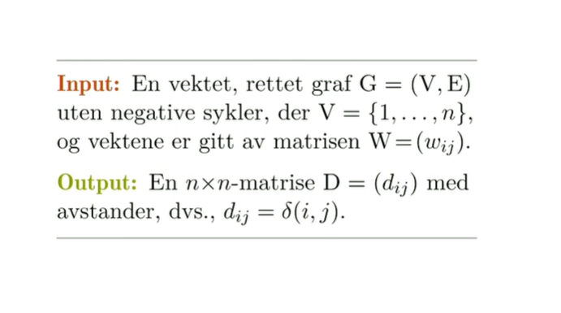

Samme problemet for alle sammen.

Dijkstras 

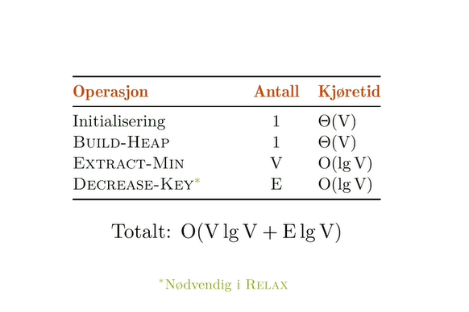

# Johnsons algoritme

Vi har en graf, en vektmatrise og skal gi ut en avstandsmatrise som er avnstanden mellom alle par med noder. 

De valgene vi gjør, før hadde vi et forgjengerfelt per node, men nå har vi en matrise med forgjengere som sier hva er forgjengeren til denne noden, hvis vi starter her. 

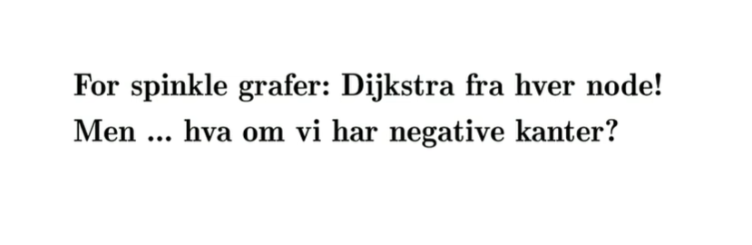

Hvis vi har få kanter lønner det seg å bruke dijkastras fra hver node! Hvis vi har nok kanter vil dijkastras kjøre raskere enn floyd warshall. Men det funker bare hvis vi ikke har negative kanter.

Johnons algoritme er løsningen på situasjonen hvor vi har ganske få kanter men vi har noen negative kanter i bildet. Da vil vi justere alle kantvektene så vi blir kvitt negative så vi kan kjøre dijkstra fra alle start punktene.

Hvoirfor kan vi ikke bare øke alle kantvektene med det samme?

Hvis laveste er -4 hvorfor kan vi ikke bare øke alle med 4?

problemet med det er at hvis en sti har mange kanter vil den økes mer enn en som har få kanter. Og det er uavhengig av hvilken lengde de hadde i utgangspunktet.

Vi er ikke garantert å bevare rangering av stiene våre på denne måten. 
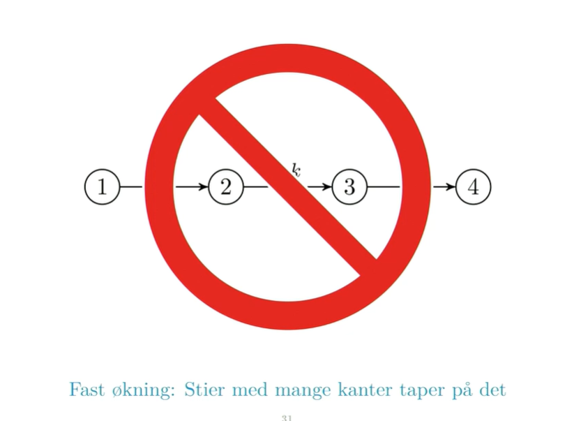

VI bruker en teleskopsum. Fordi annenhvert ledd f.eks er minus det forrige. +3,-3,+4,-4. Hvis vi slår sammen det forsvinner alt. Vi ønsker oss at langs enhver sti her har vi en teleskopsum. Vi ønsker å nulle ut alt langs stien så vi ikke endrer på rangeringa. 

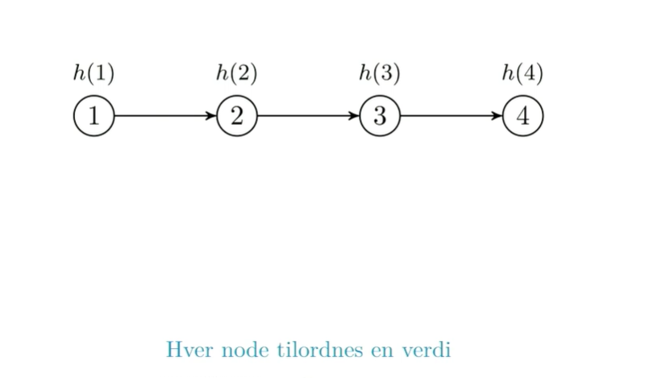

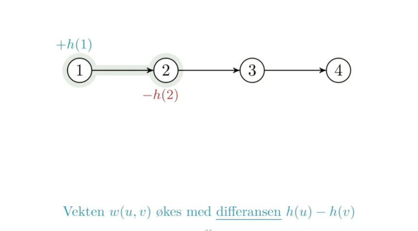

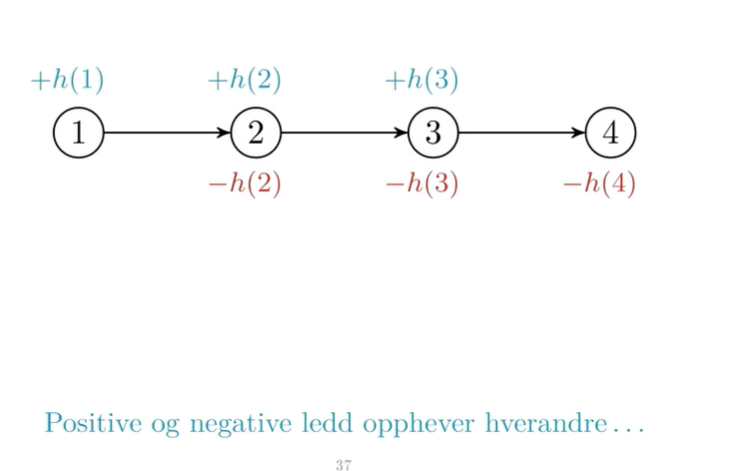
De positive og negative leddene nuller ut. Alt forsvinner bortsett fra h1 og h4 men dem er felles for alle stiene som går fra 1 til 4 så det spiller ingen rolle.

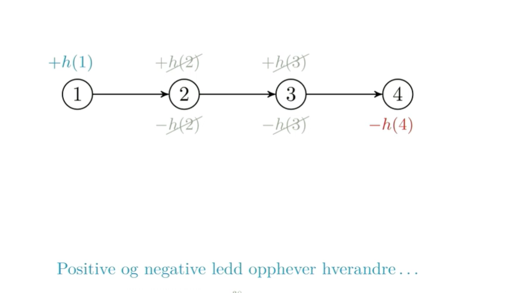

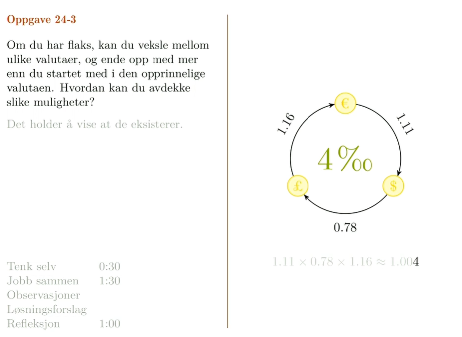

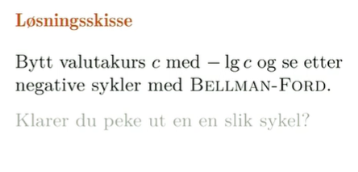
Hvorfor skjønner jeg ting?
Vel det vanskelige er at lgc så jeg aldri lmao. Mattet shittet her hadde jeg ikke hatt sjans på. Bellman ford finner negative sykler så det er smart. Og det vi vil er å finne ut om det er en måte å tjene penger på, ikke nødvendigvis finne den måten. 

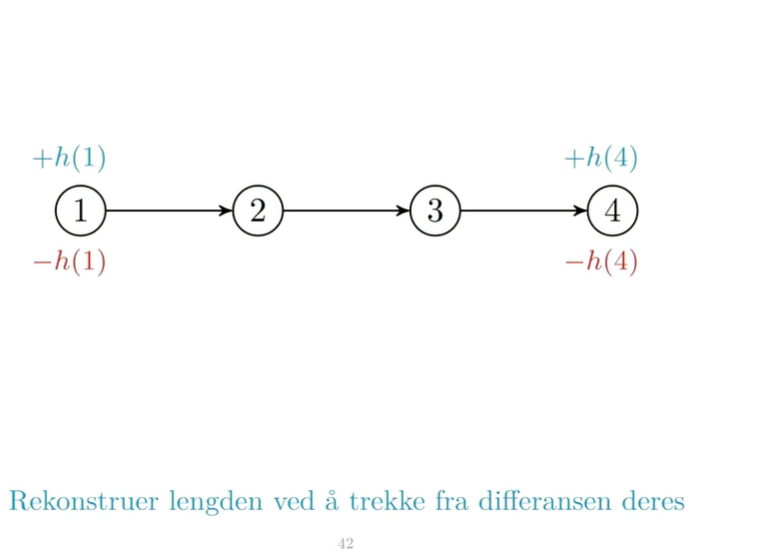

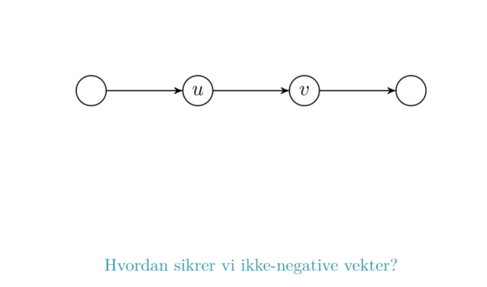

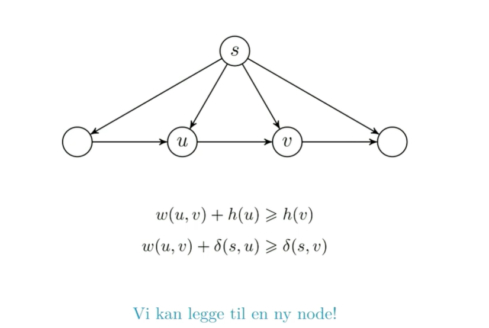

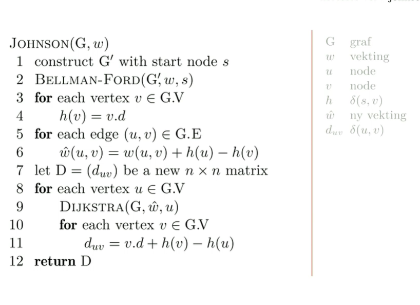

# Transitiv lukking

# Floyd-warshall

