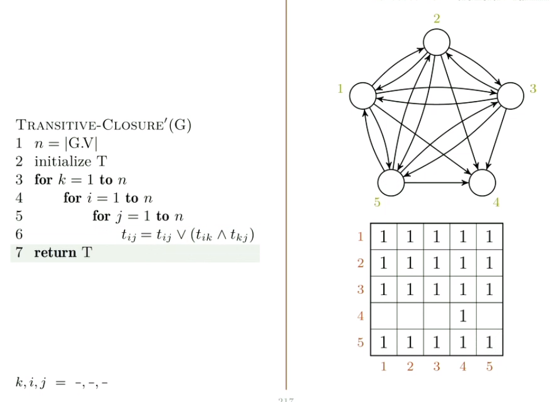
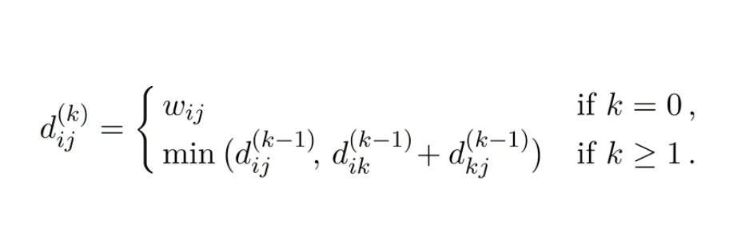

# **Korteste vei fra alle til alle**
# **All pairs shortest paths**

Samme problemet for alle sammen.

Dijkstras 

# Johnsons algoritme

Vi har en graf, en vektmatrise og skal gi ut en avstandsmatrise som er avnstanden mellom alle par med noder. 

De valgene vi gjør, før hadde vi et forgjengerfelt per node, men nå har vi en matrise med forgjengere som sier hva er forgjengeren til denne noden, hvis vi starter her. 

Hvis vi har få kanter lønner det seg å bruke dijkastras fra hver node! Hvis vi har nok kanter vil dijkastras kjøre raskere enn floyd warshall. Men det funker bare hvis vi ikke har negative kanter.

Johnons algoritme er løsningen på situasjonen hvor vi har ganske få kanter men vi har noen negative kanter i bildet. Da vil vi justere alle kantvektene så vi blir kvitt negative så vi kan kjøre dijkstra fra alle start punktene.

Hvoirfor kan vi ikke bare øke alle kantvektene med det samme?

Hvis laveste er -4 hvorfor kan vi ikke bare øke alle med 4?

problemet med det er at hvis en sti har mange kanter vil den økes mer enn en som har få kanter. Og det er uavhengig av hvilken lengde de hadde i utgangspunktet.

Vi er ikke garantert å bevare rangering av stiene våre på denne måten. 

VI bruker en teleskopsum. Fordi annenhvert ledd f.eks er minus det forrige. +3,-3,+4,-4. Hvis vi slår sammen det forsvinner alt. Vi ønsker oss at langs enhver sti her har vi en teleskopsum. Vi ønsker å nulle ut alt langs stien så vi ikke endrer på rangeringa. 

De positive og negative leddene nuller ut. Alt forsvinner bortsett fra h1 og h4 men dem er felles for alle stiene som går fra 1 til 4 så det spiller ingen rolle.

Hvorfor skjønner jeg ting?
Vel det vanskelige er at lgc så jeg aldri lmao. Mattet shittet her hadde jeg ikke hatt sjans på. Bellman ford finner negative sykler så det er smart. Og det vi vil er å finne ut om det er en måte å tjene penger på, ikke nødvendigvis finne den måten. 

# Transitiv lukking
Hvis det finnes en sti fra u til v vil vi legge inn en kant fra u til v. så den går direkte. den grafen vi endre opp med viser   om det finnes stier i den opprinnelige grafen. Vi vil ha en ny graf med samme node mengde, men en ny kant mengde hvor hvis det finnes en sti fra i til j i den opprinnelige grafen skal vi legge til en kant i den nye grafen.

Vi trenger ikke å fjerne noe, vi skal bare legge til. 

Vi bygger oss en nabo matrise fra grafen rett og slett.

Vi kunne like gjerne antatt at vi fikk in nen nabo matrise som parameter

Det du gjør er at du har den matrisen da. Du vet altså alt fra før. Det du nå må sjekke er om 
siden vi vet hva den nye kanten er. det er en kant fra u til v. hvis vi har x,u og y,v så vet vi av transitivity at vi har x,y siden vi også har u,v. x,u u,v v,y --> x,y. 
Så vi går gjennom to ganger og får n^2. engang for x engang for y. så vi sjekker alle x, med alle y?

# Floyd-warshall

Vi bytter ut og med + og eller med minus. Så gjør vi akkurat det samme.

Fra hver node til alle andre? 

hvis vi ikke går innom k går vi innom 1 til k-1. Hvis vi går innom k så vil stien 

Sist ville vi bare vite om det fantes en vei, det finnes enten en vei direkte eller en vei vi kan binde sammen og vi vil ha den korteste av dem. IStedenfor å bare ta eller tar vi minimum av dem to fordi det er dem to mulighetene vi har. 

Vi tar minimum av de to alternativene og sammenligningen er pluss istedenfor logisk or. 

Grunntillfelle blir vektmatrise istedenfor kantmatrise. 

Forgjkengermatrise kommer i tillegg nå. en sti fra en node til seg selv har ingen forgjenger. det samme gjør vi hvis vekta er uendelig. Hvis det går en kant direkte sier vi at i er forgjengeren til j i stien i til j. Når vi ikke snakker om grunntilfelle er det en annen forgjengermatrise.

Hvis direkte stien erm inst like bra som å gå via k så bruker vi bare den samme forgjengeren vi fant. Da beholder vi den stien, lengpden og forgjengeren.

Det eneste som skiller seg er hvis vi finner en snarvei via k. går frem til k så fra k. så må vi bytte ut forgjengeren. 

Vitkig aspekt ved algoritmen. Forgjenger hvis vi finner bedre vei gjennom k. da limer vi sammen fra i til k og k til j. Og tar forgjenger til k til j. 

