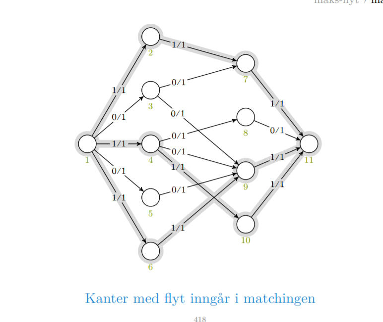

# Maksimal flyt

# Problemet

Vi skal løse det mest infløkte problemet i pensum i dag.
Er et steg i retning linærprogrammering. 

Algoritme for å løse problemet. Hovedfokuset med flyt er at man reduserer et prolblem til noe annet. Tar et problem som ser ut til å ikke ha noe med flyt å gjøre så transformerer man input til å bli et flyt problem. 

Er på et høyt nivå man skal kunne algoritmen. Trenger ikke å mestre den biten helt.

Danne en god mental modell av problemet er viktig. Spesielt det såkalte heltallsproblemet. Teoremet er viktig, beviset er ikke viktig. 

Hvis vi har heltallskapasiteter egentlig det samme som det vi har brukt tidligere når vi brukte vekter. ER et tall på kantene. Hvis vi har heltallskapasiteter blir flyten et heltall. og flyten på hver kant blir et heltall. 

Hva er flyt? 

**Ford fulkerson er metoden vi skal bruke for å løse dette.**
**Ford fulkerson med breddeførstsøk er edmondskarp**

Hvis du løser maksflyt problemet får du også løsningen på minimalt snitt problemet. 

Et flytnett 
er en rettet graf. er i praksis en vektet rettet graf, men vi kaller vektene kapasitet. Hver kant har en kapasitet. I den versjonen vi ser på er det ikke negativ. 

Summerer alt som går inn i sluket og alt som går ut er samme flytverdi.

Samme hvor vi kutter av grafen og ser hvor mye som går ut og hvor mye som går inn så er det den samme. 

Flyt / kapasitet.

# Ideer

**Retting av antiparallelle
og flere sluk.**

Hvis vi har en kant med ledig kapasitet er det også en kant i flyt nettet. Det er en fremoverkant.
Vi har også bakoverkant hvis det er flyt i flytnettet. Hvis jeg allerede ha flyt i flytnettet så betyr det at vi kan ta tilbake den flyten og sende den et annet sted, og det indikerer vi ved at det er en kant som går baklengs som representerer opphevelse av flyt.

**Poenget er at hvis det finens en sti fra kilde til sluk i restnettet så kan flyten økes. En sånn sti kalles en forøkende sti eller en augmenting path.**

Det her er ikke en rekursiv dekomponering. Vi dekomponerer flytproblemet i en serie med traverseringsproblemer. 

**Hvorfor blir det rett?**

Hva er en augmenting path? En sti som kan brukes til å øke flyten. 

En slags sti i flytnettverket som akn følge kantene fremover eller bakover og har bare lov til å gå fremover der det er ledig og bakover der det er flyt. Hvorfor det? Ford ider det er ledig kapasitet kan vi sende mer flyt og der det kjem flyt mot oss kan vi sende den tilbake og omdirigerer et annet sted. Enten sender vi mer eller så sender vi tilbake og omdirigerer noe som kommer i motsatt retning.

# Ford Fulkerson

 The Ford-Fulkerson method
depends on three important ideas that transcend the method and are relevant to
many flow algorithms and problems: residual networks, augmenting paths, and cut

1

2

3

4

Vi traverserer bare de nodene vi ikke har funnet fluyt til. 

When the capacities are integral and the optimal flow value jf

j is small, the
running time of the Ford-Fulkerson algorithm is good. Figure 26.7(a) shows an example of what can happen on a simple flow network for which jf

j is large.

I verste tilfelle kan vi bare øke flyten engang så vi må kjører i gigantisk tid.
Terminerer kanskje ikek hvis vi har irrasjonelle kapasiteter.

Hvis vi bruker BFS

HVorfor får vi VE iterasjoner?

# Edmondkarps algorithm

Sluket får like mye som flaskehalsen. 
 

# Flyt

Hvorfor bredde først?

# Minimalt snitt

In practice, the maximum-flow problem often arises with integral capacities. If
the capacities are rational numbers, we can apply an appropriate scaling transformation to make them all integral. If f
 denotes a maximum flow in the transformed
network, then a straightforward implementation of FORD-FULKERSON executes
the while loop of lines 3–8 at most jf

j times, since the flow value increases by at
least one unit in each iteration

# Maximum bipartite matching

Corollary 26.11
The cardinality of a maximum matching M in a bipartite graph G equals the value
of a maximum flow f in its corresponding flow network G0.

