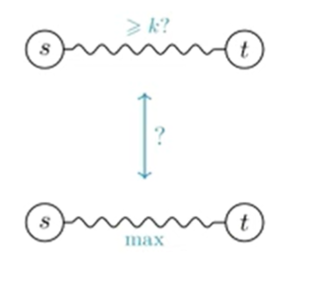
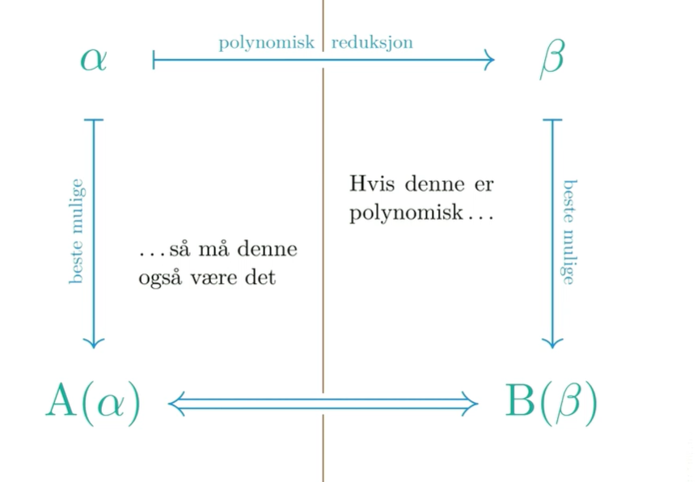
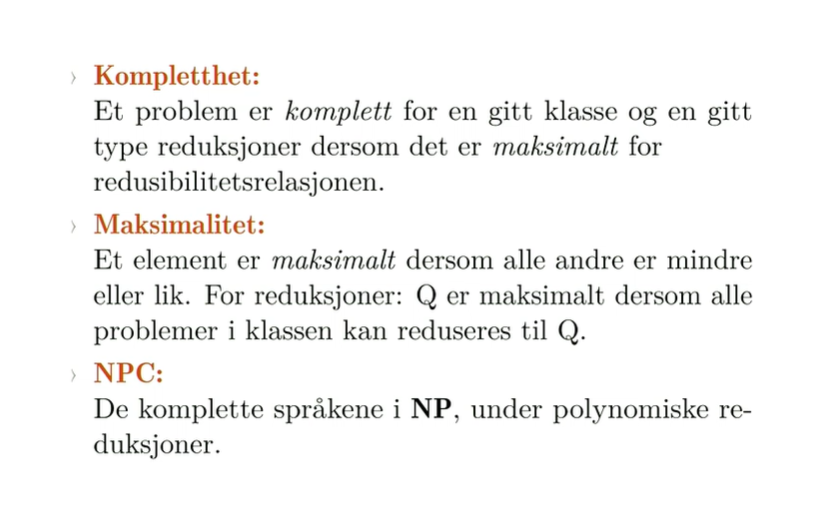

# **NP - Kompletthet**

Np komplette problemer vet vi at det er vanskelig for oss å finne algoritmer. Vi vet ikke om datamaskinene kan løse dem? Vi vet heller ikke om det finnes gode algoritmer på det. 

# Problemer
Et problem er en relasjon mellom input og output.

Et problem kalles konkret hvis input og output er bitstrenger i kontektsten i dag.
En verifikasjonsalgoritme sjekker om en løsning stemmer. 

En verifikasjonsalgoritme tar inn to bit strenger og returnerer enten ja eller nei.

Ofte vil sertifikat være et svar. 

Verifikasjonsalgoritme kan ta inn vilkåerlig bitstrenger. Det eneste vi krever er at den aldri svarer ja hvis svaret er feil. 

Et beslutningsspørsmål kan vi tenke på som ikke bare et vilkåerlig ja nei spørsmål, men som et spørsmål om hvorvidt det finnes et vitne eller et sertifikat for det her. 
Krever litt ekstra input til denne verifikasjonen det er derfor jeg ikke bare kan løse det. Jeg trenger et sertifikat som er f.eks en sti jeg skal sjekke. 

Klasser er på en måte mengder. 
Finnes ikke en mengde av alle mengder, men fins en klasse av alle mengder. 
**P er en potensielt veldig stor mengde av alle problemer som er ja/nei spørsmål og kan løses i polynomisk tid.** Hvis vi ikke begrenser oss til ja/nei spørsmål har alle problemet vi har sett på så langt bortsett fra ryggsekk problemet  vært problemer vi kan løse i polynomisk tid. 

NP omfatter en veldig stor mengde av naturlige og praktiske problemer. Det er alle problemer hvor et ja-svar kan sjekkes i polynomisk tid. Det eksisterer en algoritme som er sånn at den kan ta imot et sertifikat sammen med input og si ja eller nei og der det skal eksistere vitner som produserer et ja-svar bare hvis svaret er ja.

Svaret kan verifiseres i polynomisk tid 
Hvis jeg stiller et ja/nei spørsmål og dere svarer ja. Så kan dere gi meg et bevis som jeg kan sjekke i polynomsik tid. Hvis svaret er nei stiller det ikke noe sånt krav. 

NP står for non determnisticily polynomial. 

co-np har vi sertifikater for nei svar. 

Hvis vi har et if-statement i et program lurer på om vi havner inni den. Er et problem som ligger i np. Hvis jeg sier ja gi meg bevis, så sjekker du det. 

Det motsatte er for eksempel om vi alltid havner i den if-statementen. Er det en teutologi. Hvis du da svarer ja så er det ikke sikkert du klarer å overbevise meg. Hvis du svarer nei, så kan du overbevise meg ved å ikke ta meg inn i if-statement.

# Noen vanskelige problemer

# Reduksjoner

Hvis jeg redusrer fra A til B antar jeg at jeg har en løsning på B.

Hvis vi kan åpne B og det ligger en nøkkel til A så kan vi også løse A. 

Hvis vi har en reduksjon + en løsning på B så må vi også ha en løsning på A.

Hvis vi kan løse A sier det oss ingenting om B.

La oss si at reduksjonen er polynomisk. 
Hvis vi kan løse B i polynomisk tid så kan vi sette dem sammen. 

A --> B
-B --> -A

Hvis jeg kan redusere fra A til B, men jeg fortsatt ikke kan løse A. Betyr det at jeg umulig kan klare å løse B. Hvis jeg forteller deg at nøkkelen til A ligger i B. Så kan jeg tenke at ja da har du ikke klart å løse B heller. Det er hele cluet med hardhets bevis. Vi reduserer fra noe vi vet at er vanskelig. 

Fella er at man reduserer f eil vei. Algdat øvingen er så vanskelig, jeg kan redusere til et annet vanskelig problem ved å knuse laptoppen min. 

# Kompletthet

Hvis vi skal vise at B er like vanskelig som A. Så tar vi ett eller annet input i A og redusrer til B i polynomisk tid.

NP er universet med ting som kan reduseres i polynomisk tid. 
NP- HARd er ting som er minst like vanskelig som NP. Alt i NP kan reduserers til dem her. 

Snittet av Np-hard og NP er NPC. 

De komplette problemene er de vanskligste i klassen.

De vanskeligste problemene fra tidligere er altså eksempler på np-komplettet problemer.

Hva om vi finner en reduksjon fra npc til p? 

Da har vi en sykel. Som betyr at alt kan reduseres til alt i hele NP. Da tar vi et hvilket som helst problem, reduserer det til NPC, så reduserer det til P igjen som kan så reduseres til alt igjen.

Hvis du kan løse 1 NPC problem, samme hvilket så er P = NP 

Med mindre P = NP så ka du ikke løse NPC problemer i polynomisk tid. men det vet vi ikke sikkert.

Vi kan bruke reduksjoner til å 

Om vi reduseres til NPC får vi ikke vite noenting.

MEn hvis vi klarer å løse fra NPC til NP da blir det imponerende. 

FOr å vise at et problem er i NPC må vi redusere fra NPC i tillegg til å vise at det kan reduseres i polynomisk tid. 

