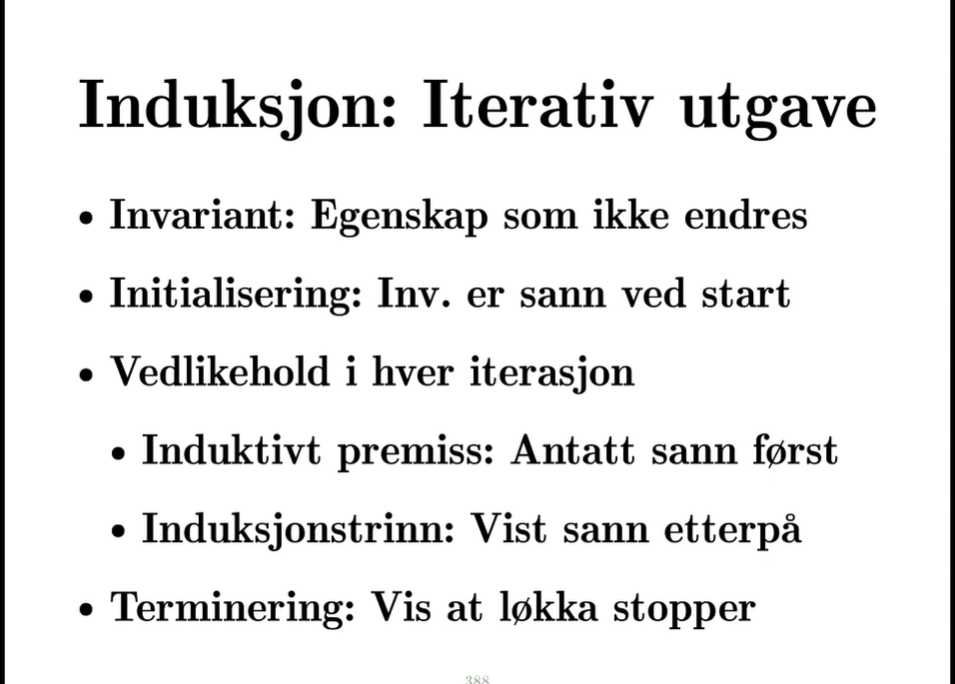

# Problemer og algoritmer

# Hva og hvorfor?

# Asympotisk annotasjon

de finnes et cutoff punkt så det er sant videre oppover. 

# **Induksjon**

Det ene er at vi velger oss noe vilkåerlig og viser at det er sant for det. Da har vi vist at det gjelder for alle ting. Så hvis jeg viser noenting for et vilkåerlig heltall uten å sihvilket det er har jeg vist det for alle heltall. 

Det andre er at vi antar en ting og utleder en annen ting og da har vi bevist en implikasjon. 

Hvis jeg antar p og klarer å utlede q har jeg bevist at p impliserer q. 

Den tredje ingrediensen, hvis jeg vet at p medfører q og jeg vet at p er sann kan jeg utlede at q er sann. 

Vi ser på en serie med trinn. Stigen

# Dekomponering

Algoritmen må løse alle instanser. Vi ser på en vilkåerlig instans.  Ved insertion sort vil det være at vi velger et vilkåerlig prefiks av sekvensen, ja de k første elementene.

VI vet ikke helt hvordan vi skal løse den instans, men vi kan finne mindre instanser som er beslektet. Vi kan f.eks dele instanse opp i delinstanser. 

VI vil sortere n elementer da tar vi bort det siste elementet så har vi en delinstans med n-1
Så kommer trylletrinnet. vi antar at vi akn løse alle delinstanser, vi vet ikke hvordan vi kan sortere en sekvens med lengde n, men vi antar at vi akn sortere en sekvens med lengde n-1 

Så da sitter vi der med en sorter sekvens med lengde n-1 og ett element som vi har klippet av. Det eneste vi trenger å finne ut erhvordan vi skal kombinere dem. Det er lett,bare å sette på plass elementet på riktig plass, som er det vi gjorde i insertion. 

Da har vi en algoritme. Vi samler delsvarene til et endelig svar. Det som virker magisk. Jeg antok jo bare at jeg kunne løse den dere, hvordan kan jeg da ha en algoritme? Poenget er at jeg løser den på samme måte. 
Antar at jeg kan løse for n-1,n-2,n-3, osv helt til 1 og det kan jeg fordi det er grunntilfellet mitt. Grunnen til at denne tankegangen fungerer er fordi det egentlig bare er induksjon.

Vi viser grunntilfellet. så antar vi at vi kan løse alle instaner som er mindre enn den instansen vi ser på så bruker vi det til å løse den instanse vi ser på. 

# Induksjon: iterativ utgave 
VI vil vise at noe er sant etter iterasjonen av en løkke når vi antar at det er sant før. 

# Eksempel sum

# Eksempel insertion sort

