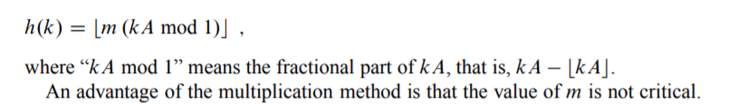

# Datastrukturer

# Stakker og køer 

## Stakker - kun adgang øverst

## Køer - først inn først ut
Vi vil ikke flytte køen. fordi det koster penger. 

# Lenkede lister

# Hashtabeller

# Dynamiske tabeller

# Amorisert analyse

**In an amortized analysis, we average the time required to perform a sequence of
data-structure operations over all the operations performed. With amortized analysis, we can show that the average cost of an operation is small, if we average over a
sequence of operations, even though a single operation within the sequence might
be expensive. Amortized analysis differs from average-case analysis in that probability is not involved; an amortized analysis guarantees the average performance
of each operation in the worst case.**

