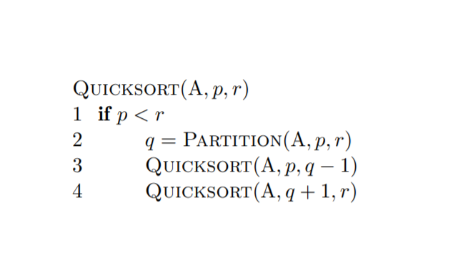
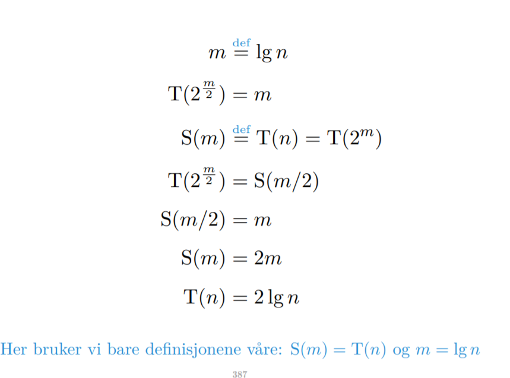

# Splitt og hersk

# Rekkurenser

Vi antar at hvis vi kommer til en eller anenn konstant, en liten nok problem størrelse er kjøretiden konstant.

T(n) = T(n-1) + 1

Det regnestykket du gjør her er at du tar

n -x = 1
så x = n-1 og setter det inn. 

Du vil bare finne en T(1) finne det du må sette x til å være for å få 1 fordi 1 er konstant og da har du reacha basecase.

på slutten kan man se på summen på et par måter. Enten som n-1 *1 (1 er casen t(n) =1) 
elelr ta summen.

Lets assume that T(n-1) = n-1

Her bruker vi base casen vår som sier at t(n-(n-1)) = 1 som er konstant aka true.

Vi må på en måte først finne et uttrykk ved rekkurens for så å bevise det med induksjon. Det er sånn vi får at t(n-1) = n-1
siden t(n) = n fra rekkurrens.
 
 

# Binærsøk

Det som vi gjør er at vi finner ut at ok n/2^x = 1 for x = lgn

så da vi må ta 1+1+1+..+1 lgn gangner
altså 1*lgn, så må vi plusse på den 1 vi har fra t(n) og får lgn+1

# Merge sort

n * lgn + n fra basecase.

# Quicksort

### Skill små og store tall

WORSTCASE QUICKSORT

# Masterteoremet

TIngen med masterteoremet er at siden alle de andre leddene er små små i forhold til det laveste kan vi bare drite i dem fordi vi har n opphøyd i noe. Da er det bare den nederste som teller, den dominerer de andre. 

Hvis f er lik det vi har nederst asymptotisk det samme. Da vil alt i mellom være asymptotisk det samme og da blir svaret at vi ganger n^logb(a) med høyden som er logbn.

# Variabelskifte

