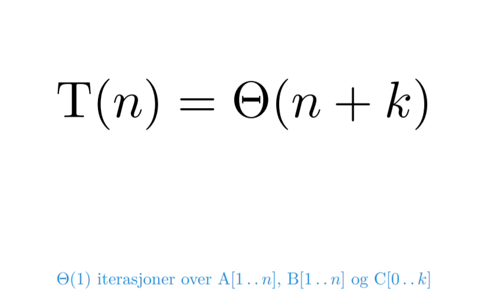
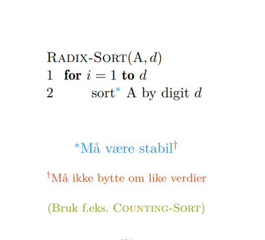
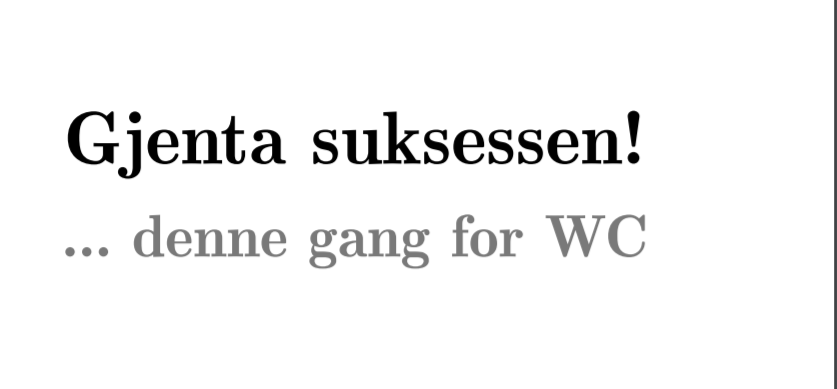

# Rangering i linær tid

Hvis vi har et balansert binært tre med n løvnoder har vi n-1 interne noder. 

# Sorteringsgrensen

Hvor fort kan vi sortere ting ved å sammenligne to og to ting? 
Bare ja nei spørsmål hvor mange spørsmål må jeg stille?
log n ! 

Antall halveringer fra n! til 1.
Hvert ja nei spørsmål halverer antall muligheter hvis jeg er smart og du er kjip. Hvis jeg ber deg tenke på en permutasjon og du velger hele tiden det som er verst for meg så kan du alltid tvinge frem et sånn logn! tilfelle.

Kan alltid ende opp med å måtte trenge logn! 
Nedre grense for verste tilfelle.

VI kan gjøre det verre enn dette hvis vi prøver det samme option om og om igjen.

Måten vi kan bryte denne grensen på er ved å gjøre ekstra antagelser.

# Countingsort

# Radix-sort

Skal være motsatt

for i = d to 1.

sort a on digit i

# Bucketsort

# Randomized select

Randomized seelct funker slik. Først kjører vi rand partition og bruker et splitt elementet så setter vi alt som er større på høyre og mindre på venstre. 

Så er den mindre da enn split så da søker vi videre i venstre delen. 

Så kaller vi rs på den venstre delen da 
så får vi et nytt split element med ny partition og hvis den ikke er lik så søker vi igjen. 

Så må du endre rang fordi du må trekke fra. 

I utgangspunktet blir ikke sekvensen sortert. 
Den trenger ikke å sortere hele sekvensen men vil sette det elementet på riktig plass. 4. største så er det på 4.største posisjon. 
Alt som er mindre står over alt som er større er under.

Det vil si at du kan bruke dette til å finne de 10 minste. Du leter etter Det 10 største. Så får du posisjonen, så vet du at alt under er mindre og er de 10 minste. 
Du kan finne de k minste i theta(n) tid. 

hvis du skulle gjøre det mer naivt ville du fått n*k, men k forsvinner helt her. 

# Select

Vi bruker select for å få Utvelgelse av median, og lignende elementer. Det elementet som har en viss posisjon i den sorterte rekkefølge. Det vil vi finne uten å nødvendigvis sortere sekvensen. Er en grense på nlogn hvis vi sorterer.

I den randomiserte versjonen kunne vi ha uflaks. Splitt elementet kan havne helt ut til sida. n^2 kjøretid.

Men hvis vi klarer å finne et pivot som er nær midten, eller en viss prosent av sekvensen på hver side så er vi garantert linær kjøretide.

Select har worst case garanti, den er ikke kjempeannvennelig i praksis, men rent teoretisk. Trenger et godt splitt elementet. I randomized select velger vi det randomisert, men vi er ikke garantert noenting. Kan vi bruke select til å velge en god pivot?

trenger en god pivot for å bruke select, og kan vi bruke select for å finne bra pivot. 

