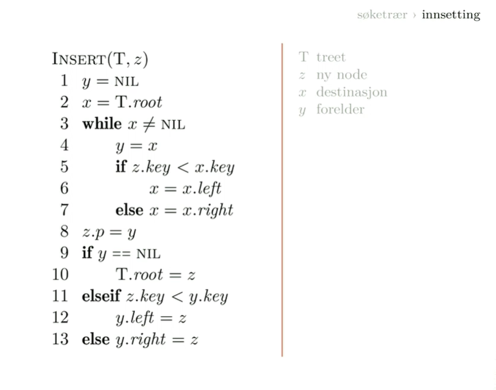

# Rotfaste trestrukturer

Rotfaste har en utpekt node som er roten. vi sier det der er noden også ser vi resten utifra denne noden. 

Søke trær -> ordner ting horisonalt så det ene deltreet er mindre enn roten og den andre er større.

I en heap så ordner vi ting vertikalt så roten er større enn barna eller mindre nedover. 

A priority queue is a data structure for maintaing a set of elements S each with an associated value. A MAX PRIORITY QUEUE supporst the following operations

insert(S,x)

Maximum(S)
extract-max(S)
increasekey(s,x,k) increase the value of the element x's key to the new value k. which is assumed to be at least as large as x's current key value. 

min priority queue

insert() min() extract-min() decrease-key()

# Trær

   

- **I et ordnet tre har barna en ordning. Så vi kan snakke om høyre og venstre f.eks**Hvis vi har et tre og peker ut en rot så har vi ikke en rekkefølge.
- I et posisjonstre har vi en ordning og hvert barn har en posisjon, barn kan dermed mangle. Går ann å bare ha en høyre og en venstre.
- Et binærtre er et posisjonstre der hver node har to barneposisjoner. 

rota har dybde 0, barna dybde 1 så går det videre nedover.
**Den løvnoden som er helt ned definerer høyden til treet.**
Det treet her har høyde 3, ikke høyde 4.

hver node har to barn så for hver generasjon så dobles populasjonen.
Det vil si at hvis vi har n løvnoder. 
så blir dybden på trærne log n
Det vil si at de trærne her er veldig flate. Hvis operasjonene bare er avhengige av høyden er de veldig effektive. 

hvis vi har n noder så har vi n-1 interne noder.
Alle må tape i hver match unntatt den ene som vinner igjen som er n-1.

**Fullt binærtre: Alle interne har to barn**

**Balansert binærtre:**
-    Alle løvnoder har ca. samme dybde
-    Ulike definsjoner og varianter
-    Uansett: Samme asymptotiske dybde
  **Komplett binærtre: Alle løvnoder har nøyaktig samme dybde**

# Hauger

Max-heaps
Plasserer de største på toppen så foreldrene er større enn barna. 
**Struktur:**
Vanligvis er nodene i en tabell så regner vi ut hvor foreldre og barn er hen. 

Left(i) = 2*i
Right(i) = 2*i +1 
Parent(i) = floor(i/2)

#### Vedlikehold

Vi har max-heapify(A,i)

VI går fra siste løvnode tilbake til roten og reparer en og en node. 

### Hvorfor er haugbygning linært?

En med høyde 3, to med høyde 2 4 med høyde 1 og 8 med høyde 0.

Arbeidet vokser linært oppover, men antallet ganger vi kaller prosedyren halveres så det synker eksponensielt. 

**Det tar linær tid å bygge en haug.**
# Hauger > prioritetskøer
**Finn maksimum**

**Insetting**

# Hauger > Heapsort

**Selection sort - med en haug.**
Speilbildet av insertion sort. 
Insertion sort setter vi hele tiden ut det første elementet i selection sort henter vi hele tiden ut det neste elementet vi ønsker. 

# Søketrær
Binærsøk blir veldig dyrt å sette inn og ta ut ting fordi v ibryr oss omhva som er til venstre og høyre. I en heap er vi ikke så veldig nøye. Vi bryr oss om at de over skal være større men ikke til venstre og høyre. 

Kan ha tusen barn i søketrær vil ha så flatt som mulig, liten dataaksess. 

**Traversering av trær.**

Hvordan sette inn? vi søker opp hvor noden skal være hen? I denne implementasjonen så bruker vi ikke den rekursive versjonen, vi gjør akkurat det samme bare at vi bruker en løkke. Dt er en litt enklere måte å gjøre det på. 

VI har laga en node så vi har en nøkkel, kanskje den vi er interessert i. 

Man bare søker seg frem til første ledige plass hvor manoverholder det at man går til venstre hvis man er mindre og til høyre hvis man er større.

