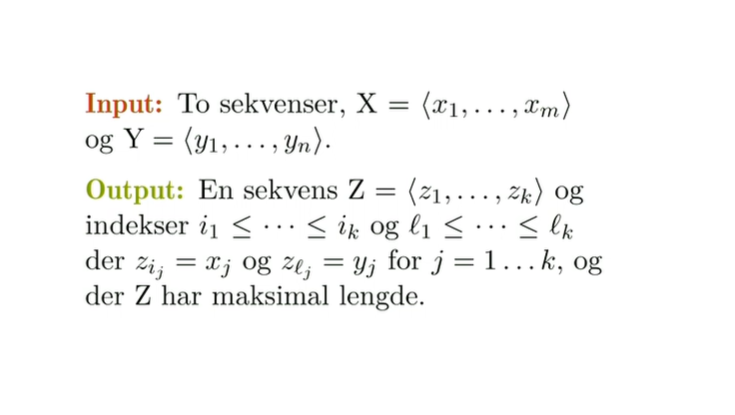
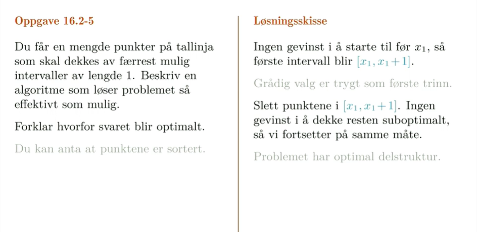

# **Dynamisk programmering**

# **Stavkapping**

i motseting til quicksort og mergesort vil vi her få samme rekursive kall flere ganger.  i merge sort, sorterer ene halvdelen, andre halvdelen ingen interaksjon, ingen overlapp. det mer generelle tilfelle hvor vi ikke kan anta det.

Vi deler fortsatt opp problemet i biter og antar at vi kan løse dem, dem igjen vil være avhengige av andre delproblemene men hvis vi nøster det lengre ned kan de være avhengige av de samme delproblemene osv.
Får eksponentielt mange veier ned til det samme delproblemet.

ulike lengder har ikke bare ulik pris, men også ulik meterpris.

Vi skal finne ut hvordan det lønner seg å dele opp denne staven, hvordan skal vi kutte opp for å få mest mulig når vi selger det.

Vi skal først gjøre et valg så enda et valg.

Måten vi dekomponerer på er å si vi bryr oss bare om det første valget eller det siste valget avhengig av hvordan vi ser på det. 
Grunnen til at jeg kan bry meg om det er fordi jeg kan løse resten rekursivt. 
Så lenge jeg kan anta at den neste kutter riktig så bryr jeg meg bare om hva jeg selv kutter. 

Et sted må jeg kutte for å få det riktig valget.
Er ikke sikkert at et hvert ktut gir riktig right?
hvis jeg kutter av på 1 så vil ikke den nødvendigvis gi riktig, men enten 1 eller 2 eller 3... osv vil gi riktig. og hvis jeg gjør det riktig 100% så gjør du det riktige 100% så får vi det riktige og jeg kan anta at du tar det riktige valget fordi jeg selv gjør det riktige valget og induktivt ved rekursjon. 

jeg må prøve alle disse valgene, men når jeg har prøvd kan jeg velge det som gir best resultat. 

**Hva var egentlig metoden vi brukte for å løse stavkappingsproblemet?**

# **Dyn.prog > hva er det?**
**Oppskrift fra boka**

- Characterize the structure of an optimal solution. Hvordan kan jeg beskrive alle disse instansene. Inputen og delproblemene trenger ikke nødvendigvis være helt like.
- Recursively define the value of an optimal solution
- Compute the value of an optimal solution
- Construct an optimal solution from computed information Vi trenger bare å lagre hvilket alternativ vi har valgt. 

# Generell algoritme

Får inn en tabell, deler den inn i delinstanser direkte. Quicksort/mergesort deler tabellen i to. Rodcutting - får n forskjellige instaner hvor vi kutter av lengde. 

Trenger bare divide og combine, resten er fast.

Dynamisk programmering er **NYTTIG** når vi har overlappende delproblemer.
Dynamisk programmering er **KORREKT** når vi ha optimal substruktur.

# Memoisering

Vi gir funksjonen hukommelse: Har jeg fått disse argumentene før? 

Bottom up løsnignen har gjerne mindre overhead. Iterasjon over alledelinstanser. i stedet for rekursjon: Slå opp i løsninger du alt har regnet ut og lagre alt i en tabell. 
# **Eksempel: LCS** lengste delfølge.

Vi ønsker å finne en subsekvens som er felles og så lang som mulig. 
Hvordan kan vi gjøre det? det brukes mye i bioinformatikk for å matche dna sekvenser osv. 

Kartlegg delproblemer er første steg. 
vi infører en addresse til delproblemene våre. En parameter per sekvens?

Må klare å addressere delsekvensene med to forskjellige indekser.
For å kunne bruke dynamisk programmering med en k-dimensjonal tabell må man ha k indekser.

Hvert delproblem vil være et prefiks av den ene og prefiks av den andre. Vi har uansett to sekvenser vi skal finne felles delsekvens for. 

Hvis vi har problemet på toppen.
ulike siste-elementer gir to delproblemer. en av dem må bort.
Nå har vi to nye sekvenser som vi vil finne lengste delsekvens på. En av disse vil være riktig løsning, men vi vet ikke hvilken så vi løser dem rekursivt. Så får vi vite hvor bra dem er så velger vi den beste av dem. 

Hvis siste bokstav er lik så låser vi den og sier den vil vi ha. vi vinner ingenting på å kutte av den ene eller den andre. 

hvis xi og yi er lik så tar vi løsningen opp til venstre på skrå og tar den +1. vi tar altså den lengste delsekvensen av klappe og takpap og vet at vi kan slenge på en p etterpå så vi har +1. For dem andre to får vi ikke +1 fordi vi ikke har noen match. 

# **Optimal** **Delstruktur**

principle of optimality er det vi egentlig kaller optimal delstruktur.
Det har vi, hvis uavhengig av det første valget så må resten løses optimalt for at vi skal kunne få en optimal løsning totalt.

Det betyr at det finnes en optimal løsning som består av optimale delløsninger.

Vi vil finne korteste vei fra 1 til 4
det er også korteste vei fra 1 til 3 og fra 3 til 4.
eller 1 til 2 og 2 til 4.
**Optimal delstruktur**

### 01-knapsack
Du kan velge 0 eller 1 av noen ting. Problemet er at vi har et sett med N objekter. 

den har to egenskaper v -verdi og w- vekt.

Vi skal velge ut objekter for å få størst mulig verdi uten å gå over kapasiteten. 

for hver item kan vi enten ta den med eller ikke. Hvis vi tar den med så legger vi til verdien og vekten. hvis ikke så gjør vi ikke noe. 

Vi har bare 1 av hvert objekt er greia. så for 3. eneste vi kan stappe inn der sammen med 2 som vi har funnet ut hittil er 1. 
Det jeg pleide å tenke var at jeg kunne putte inn 1 og 1 og 1 osv så få høy, men det er ikke samem som log cutting issue. det er et annet problem. 

Knapsack er et såkalt np komplett problem.

Les mer fra pensumhefte [her](../pensumhefte.md#Appendiks-D)

# Fastest way through station

