# **Grådige algoritmer**

> Hva er grådighet først og fremst?

Hvis vi har uavhengige delproblemer: Splitt og hersk.

De tilfellene vi er avhengige av flere delproblemer.

De gangene vi har kjedet delproblemer. 

Det vi begynner med for å sjekke grådig er først gå dynamisk programmering vei. Så gjør det om til iterativt. 

# **Elements of the greedy strategy:**
1. **Determine the optimal substructure of the problem**
2. **Develop a recursive solution**
3. **Prove that at any stage of the recursion, one of the optimal choises is the greedy choise. Thus it is always safe to make the greedy choice**
4. **Show that all but one of the subproblems induced by having made the greedy choice are empty**
5. **Develop a recursive algorithm that implements the greedy strategy**
6. **Convert the recursive algorithm to an iterataive algorithm**
**Uavhengige delproblemer -> Splitt og hersk**

# **How we design greedy algorithms:**
1. **Cast the optimization problem as one in which we make a choice and are left with one subproblem to solve**
2. **Prove that there is always an optimal solution to the original problem that makes the greedy choice, so that the greedy choice is always safe.**
3. **Demonstrate that, having made the greedy choice, what remains is a subprbolem with the property that if we combine an optimal solution to the subproblem with the greedy choice we have made, we arrive at an optimal solution to the original problem.**

**Overlappende delproblemer -> dynamisk programmering**

**Hvis vi setter opp en DP løsning, men velger før vi setter opp svaret har vi en grådig løsning**
> Det går alltid ann å løse problemet med dynamisk programmering istedet. 
>  Hvis du har satt opp med dynamisk kan du løse med splitt og hersk er bare enda mer ekstra arbeid.

Divide and conquer kan man alltid begynne med hvis vi har overlappende bytt til dynamisk. Kan vi foreta et valg før rekursjonen ok da kan vi gjøre det grådig. 

Vi løser kun den mest lovende og baserer oss på den. 

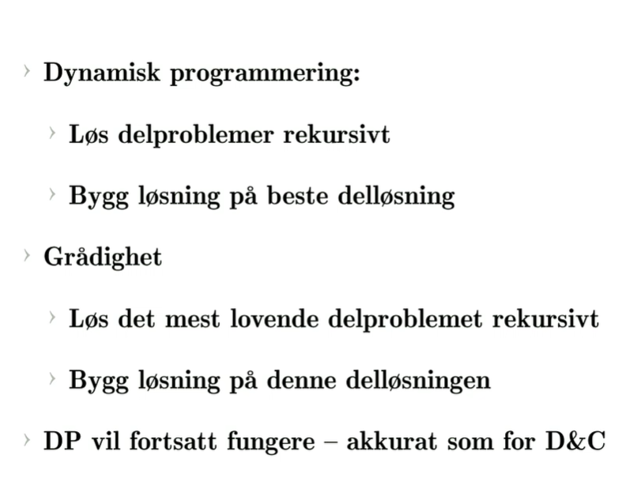

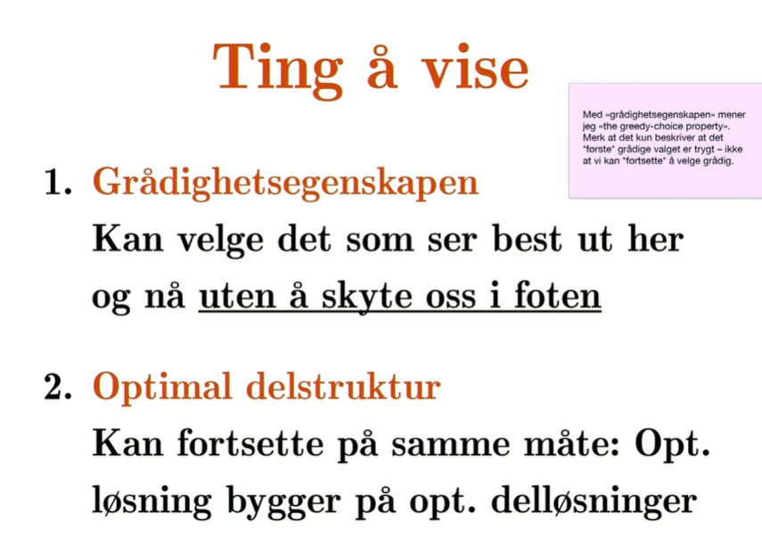
Grådighetsegenskapen sier at hvis jeg velger en ting grådig fins det fortsatt optimal løsning?
Vil det lønne seg å løse resten optimalt som en instans av det samme optimeringsproblemet? fordi det vil lønne seg da kan jeg bruke den samme algoritmen. da kan jeg gjøre et grådig valg som jeg får en delinstans kan løse optimalt. 

Hvis vi ikke har optimal delstruktur, kan det godt være trygt å gjøre et grådig valg men eri kke sikkert vi kan fortsette da kan vi ikke bruke grådig. 
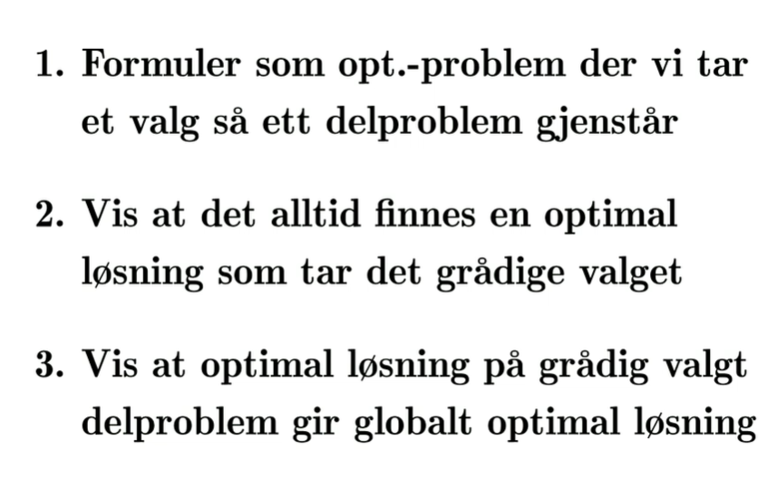

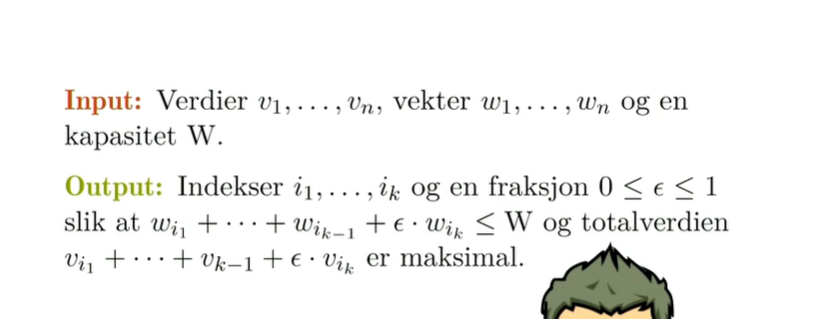

# **Fraction knapsack problem**

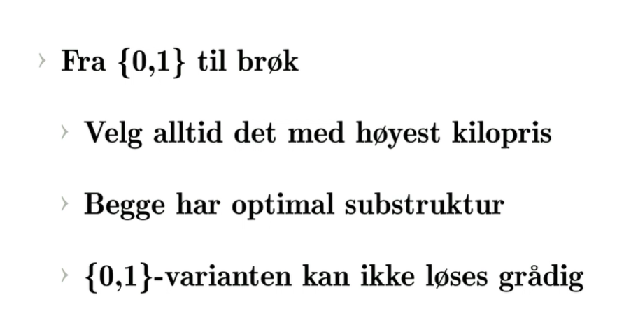

**velger det med høyest verdi per vekt. 
Hvorfor blir det rett?**

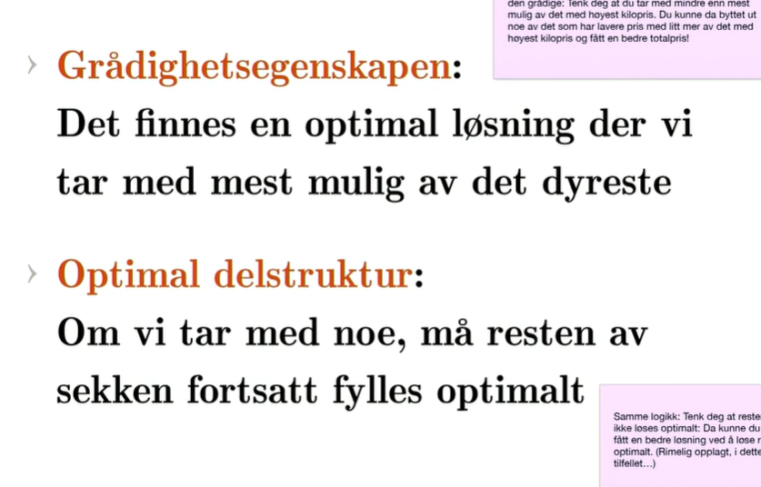

# **Aktivitetsutvalg**

Recursive activity selector
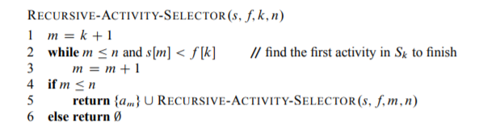
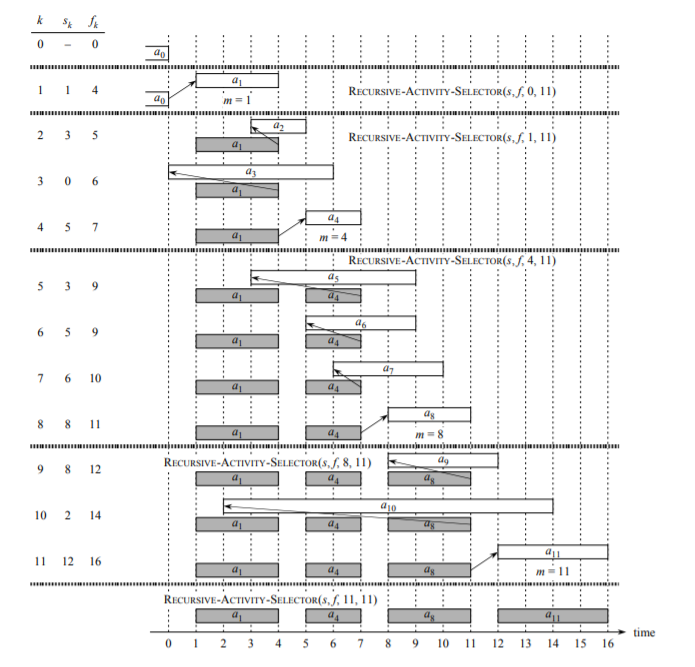

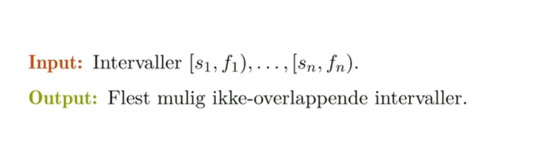
h
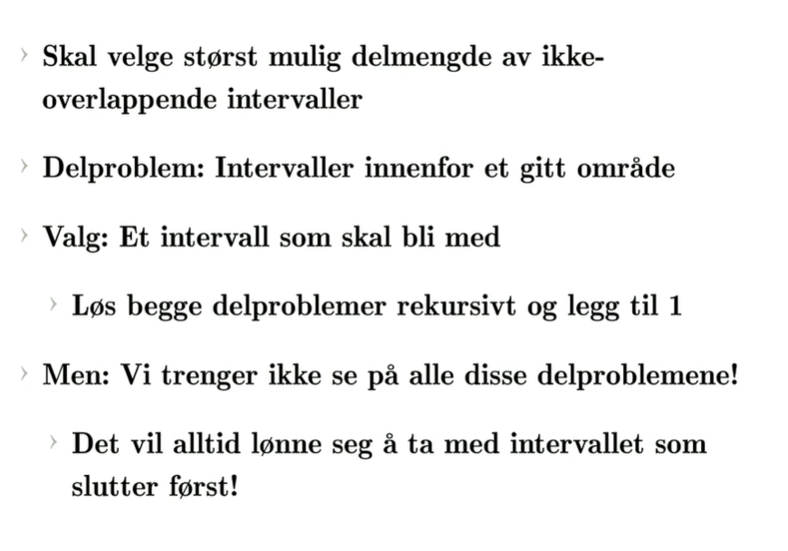
g
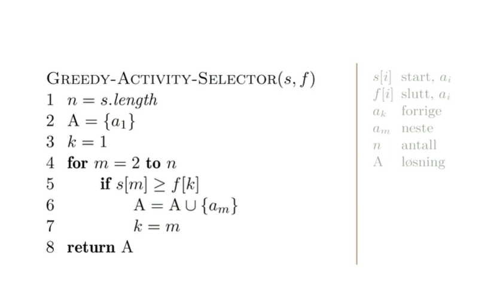

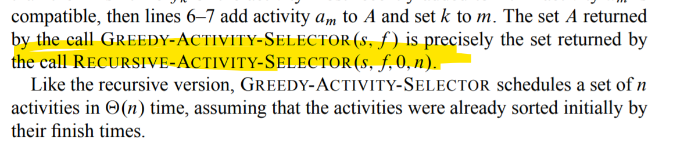
h
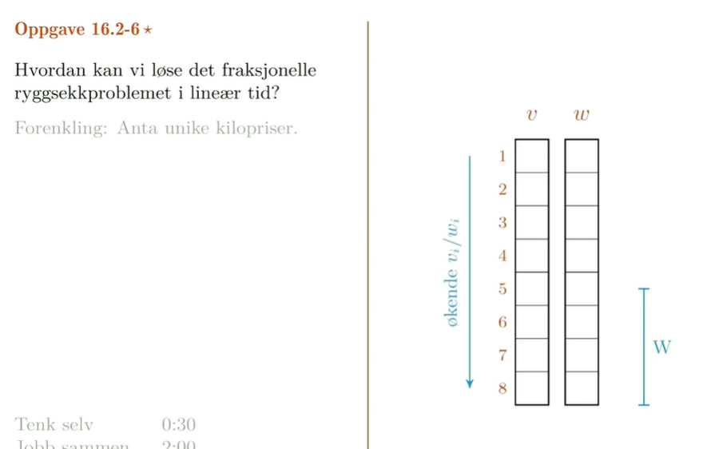
løse det fraksjonelle eller kontinuerlige ryggsekkproblemet i linærtid. 

VI har et sett med gjenstander som er noe vi kan kutte av en bit men kan likevel tenke at det er gjenstander.
Vi skal velge etter synkende kilopris.
Vi skal fylle op psekken fra den dyreste til den billigste.
Vi kan ikek anta at det er ting som er uniformt fordelt mellom 0 og 1 så vi kan ikke bruke bucketsort eller counting sort. Kanskje vi kunne brukt radix, men det kan være vilkåerlig store heltall.

Vi må på et eller annet vis sortere dem eller gjøre noe lurt for å velge ut best kilopris.

**Hvordan skal vi løse det?**
**> Vel la oss si at vi bruker en heap, så velgere vi det beste? Blir ikke helt linær. Blir helt korrekt og vi vil ha linær bygge tid, men hvert element vi tar ut vil ta logaritmisk tid så avhengig av hvor mange vi må ta ut kan det bli mer enn linært. **

Bygg en max-heap og hent ut fra toppen. Vi vil bygge en max-heap på linær tid og de tyngste er på toppen, men vi er ikke helt sikker på at de tyngste er på toppen, men vi er ikke garantert at det blir helt rett. Det er en heuristisk løsning, veldig nærme helt korrekt, men vi er ikke helt sikre. 
De n/2 minste elementene ligger ikke nødvendigvis i den siste halvdelen av en max-heap. 

Sorteringsgrense - minst nlgn tid i worst case.

> En annen måte er å bare begynne å fylle den opp med gjenstander.
 
> Først fyller vi den opp så langt vi kan. Deretter hvis det er flere gjenstander

 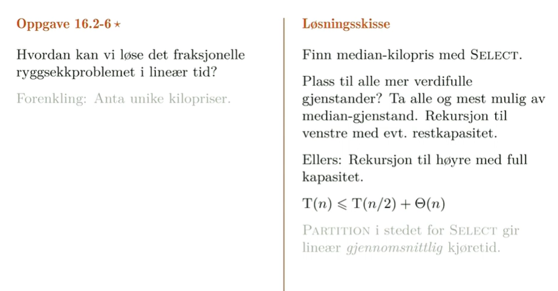

 Det du må gjøre når du ser sånne oppggaver som foreksempel sier linær tid osv er: Tenk på en algoritme vi har lært som har linær tid og deretter bygg løsningen på det. 

 1. Husk at man kan finne median i linær tid.
 2. Deretter bruk den ideen til å finne hvor skillepunktet går
 3. For det tredje må du skjønne at det tar linær tid siden du halverer halverer halverer.
 4. Må jobbe systematisk.

# Huffmans algoritme

Det er en grådig algoritme og er et problem som egentlig er litt overraskende at det kan løses optimalt med gåridghet.
Handler om å finne den optimale komprimeringen av en tekst under noen enkle antakelser. Kan komprimere bedre bedre hvis vi gjør flere antakelser. 
Her er antakelsen vår bare at vi vet frekvensen til et tegn, eller hver byte. vi vet hvor ofte hver byte forekommer. Hvis vi bare baserer oss på frekvensen er det den optimale måten. 

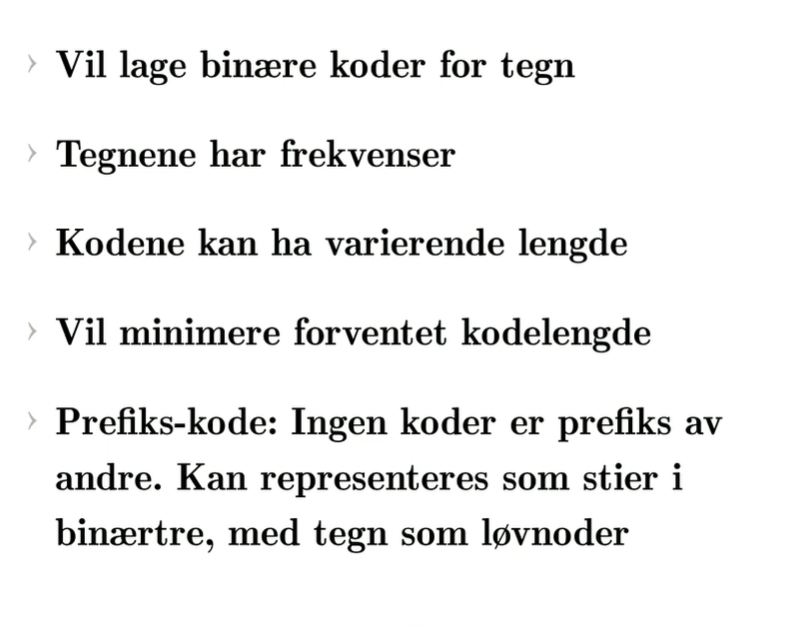

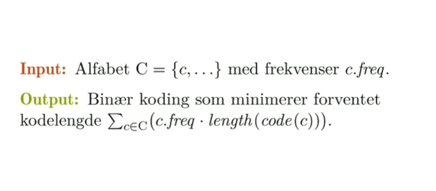

Vi vil lage binære koder men vi vil ikke at de ksal være like lange fordi da spille det ingen rolle hva vi gjør.
Vi vil ikke si at vi har to bytes per tegn eller noe sånt.
Da har vi ikke komprimert noe som helst.

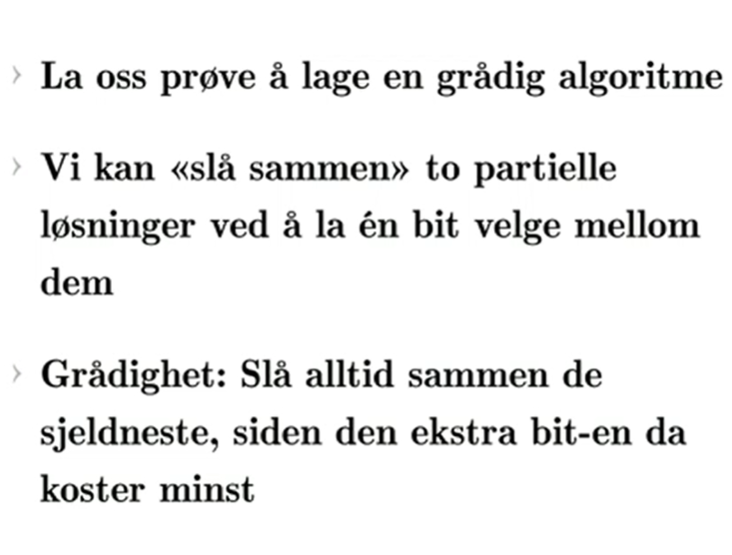

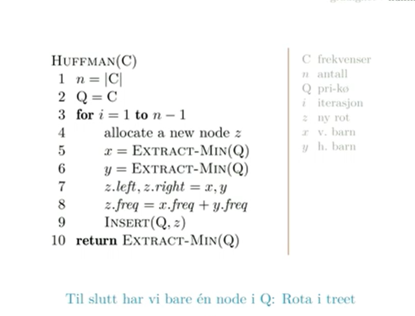

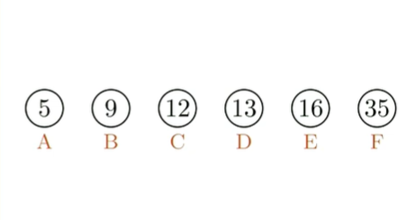

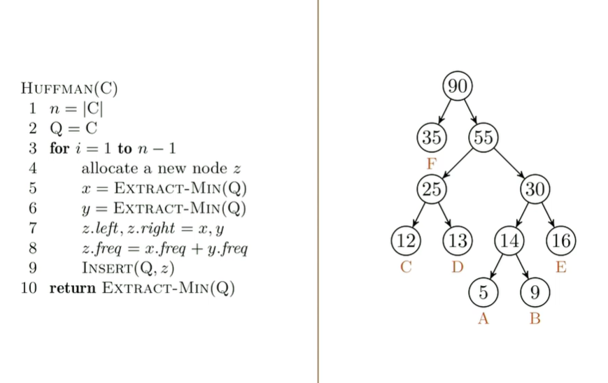

Korrekthet:
Vekslingsargument.
Tar en annen løsning, samme hvilken, med de sjeldneste lenger oppe i treet. Så tar vi vekslinga hvor vi veksler tilbake til den grådige.
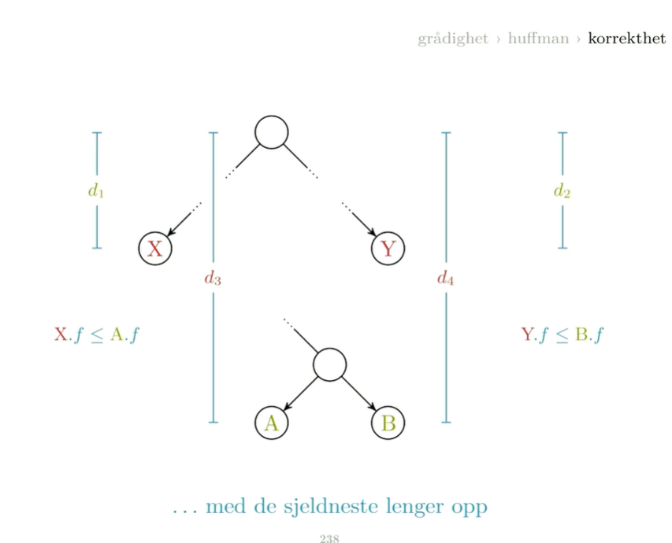
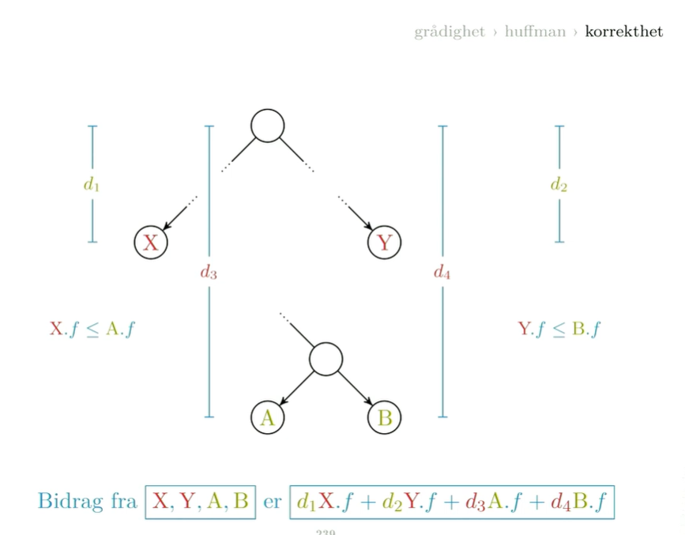

Vi kan nå bytte plass på a og x og b og y
