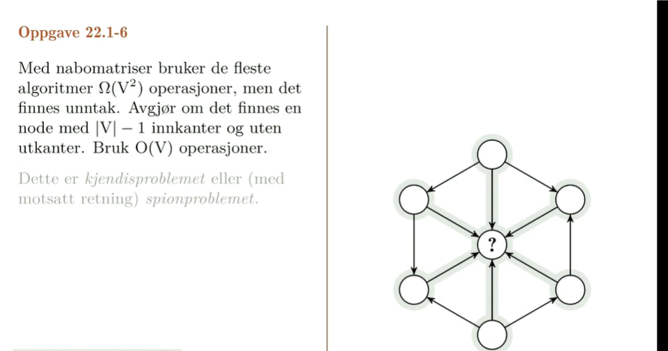

# **Traversering av grafer**

# Representasjon av grafer

## Nabomatrise

    Mer plass
    Må være kvadratisk i størrelse altså 6x6 etc.


    Det som skjer her er at vi går fra 1 til 2 som vi kan se. først på rad så kolonne. rettet graf så 2 1 er ikke aktivert.


## Naboliste

    mindre plass ofte.

**Nabolister: liste eller(tabell) med ut-naboer for hver node**


    kompakt, egnet til traversering; ikke så egnet til raske oppslag.



    Ok så det som skjer er at alle de 6 nodene rundt den midterste vet hvem den midterste er, men den midterste vet ikke hvem noen av de utenfor er.
    vi vet at det tilsammen er 7 noder. Det vi gjør er å traverse på en måte slik at vi sjekker node1. deretter node2 osv.. helt til node6.
    vi kan da se at alle nodene har noen inn og noen ut og at node7 har bare inn og ingen ut siden den ikke finnes i noen av de 6nodene. må ha en rad med bare 0 og en kolonne med bare 1.
    Hvis 1 er kobla til 2 kan vi forkaste 1 siden final ikke skal ha noen utkanter.
    hvis 2 er ikke kobla til 4 kan vi forkaste 4 fordi final skal ha alle innkanter.  osv osv osv.


    Det som vi gjør er hvis det står null i cella går vi til høyre. hvis det står 1 går vi ned.
    Så hele poenget her man må skjønne handler om at hvis vi er i en node og ikke har en kant ut til en annen node vil det si at den andre noden mangler en kant inn og vi kan forkaste den. hvis vi derimot har en kant ut vil det si at vi har en utkant som ikke skal være og kan forkaste oss.

#### Traversering generelt - vi besøker noder, oppdager noder langs kanter og vedlikelholder en huskeliste på noder vi har sett men ikke har besøkt enda.


# Bredde først søk

**BFS: Naboer stille seg i kø. (vanlig kø, fifo ( first in first out))**

Sprer seg utover lagvis.


Her skjer det noe interessant i og med at vi først stter opp besøk node1.
så gjør vi det
deretter besøk node og besøk node 3.
så kommer vi inn i node 2 og der ser v iat den er koblet til node3, men vi skriver ikke node3 opp igjen siden den allerede er der.

**Hver node har en parent eller predeccessor, forgjenger**

-   Det er den noden vi kom fra da vi kom til noden.

Forgjengerne utgjør traverseringstreet

Traverseringstreet aangir hvordan vi har oppdaga alle nodene.

### **Så lenge vi bruker en fifo kø (dvs.., BFS) så finner vi korteste vei; Ellers risikerer vi å finne noder via omveier.**


    initialisering


    Løkken som kjøres.
    Felles for alle traversering er at vi kjøres så lenge Q ikke er tom.


    etter at init er kjørt.


etter at bfs er ferdig.

```python
def PRINT_PATH(G,s,v):
    if v == s:
    print(s)
    elif pi[v] == null:
        print("no path from"+s+"to "+v+"exists")
    else
        PRINT_PATH(G,s,pi[v])
        print(v)

```

## Oppgave


# Dybde først søk

**Som BFS, men med LIFO kø**

**Enklere å implementere rekursivt**

**LIFO køen blir da i praksis kallstakken**

    Kallstakken inneholder de lokalevariablene, returadresse og parametere

Besøk oppdagede noder umidelbart


initialisering
**DFS-VISIT ER DEN faktiske traverseringen**


#### Kantkvalifisering

-   Tre-kanter
    -   Kanter i dybde-først-skogen
-   Bakoverkanter
    -   Kanter til en forgjenger i DF-skogen
-   Foroverkanter
    -   kanter utenfor DF-skogen til en etterkommer i DF-skogen
-   Krysskanter
    -   Alle andre kanter
-   Møter vi en hvit node
    -   Tre-kant
-   Møter på en grå node
    -   bakoverkant
-   Møter en svart node
    -   forover eller krysskant
    -   om det er forover eller kryss kjem an på start og slutt tidspunktan

**Tre kanter utgjør dybde først treet**

## **Parentesteoremet**

**Stigende discover tid er ikke trygt**

**Synkende finish-tid er trygt**

-   dvs det gir en topologisk sortering
-   Theorem 22.7(s 543)


# Topologisk sortering

    - Gir nodene en rekkefølge
    - foreldre
    - foreldre før barn
    - Evt.: Alle kommer etter avhengigheter
    - Det er egentlig det vi gjør med delproblemgrafen i     dynamiskprogrammering
    - A topological sort of a dag G = (V,E) is a linear ordering of all its vertices such that if G contains an edge (u,v), then u appears before v in the ordering.
    - A directed edge (u,v) indicates that garment u must be donned before garment v.
    - A topological sort therefore gives us an order for getting dressed.


**Topological sort(g)**

1. call Dfs(G) to compute finishing times v.f for each vertex v
2. as each vertex is finished insert it into the front of a linked list
3. return the linked list of vertices.

-   we can perform a topological sort in theta(V+E) since dfs takes v+e and insertion is constant.


-   I Dynamisk programmering med memoisering: Vi utfører implisitt DFS på delproblemene
-   Vi får automatisk en topologisk sortering: Problemer løses etter delproblemer.
-   Det samme som å sortere etter synkende finish tid


# Generell gravtraversering

    BFS kan tilpasses til å oppføre seg omtrent lik DFS ved å bytte ut first in first out køen med en LIFO kø eller stack. Vi mister da tidsmerkningen men rekkefølgen noder farges grå og svarte likt.
    DFS slik beskrevet i boka har ingen start node.
    Det at vi bruker en fifo kø er det som lar bfs finne de korteste stiene til alle noder siden vi utforsker grafen lagvis, men vi kan egentlig velge vilkårlige noder fra Q i hver iterasjon, og vi vil
    likevel traversere hele den delen av grafen vi kan nå fra startnoden.

Les mer fra pensumhefte [her](../pensumhefte.md#Appendiks-E)
