# **Minimale spenntrær**

# Disjunkte mengder

    En disjunkt mengde har en collection av disjunkte dynamiske set. Hvert set er identifsert av en representant som er et medlem av settet. Hvis vi spør to ganger om representant får vi samme.

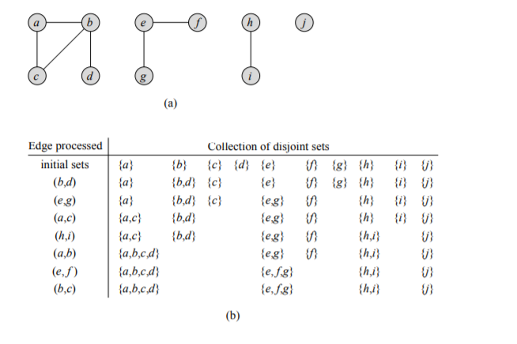

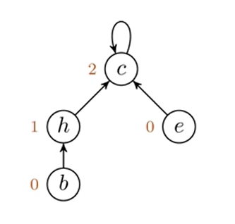

**Har to heuristikk. hver for seg sier det ikke mye men hvis vi bruker begge samtidig får vi et veldig klar øvre grense.**

**For union by rank heuristikk. Rang er øvre grense for nodehøyde.**

    For hver node beholder vi en rank som er en upper bound til høyden på noden.

**Path compression er andre heuristikk.**
    
    Vi bruker det under find-set operations for å gjøre slik at hver node peker direkte på rot noden. path compression forandrer ikke rank. 
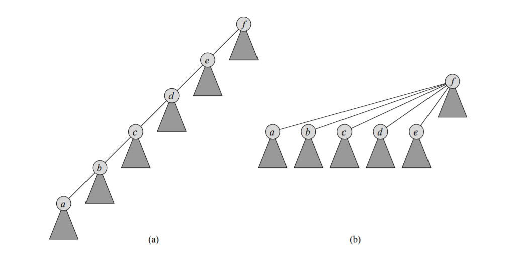
```python
    # Dette er initialiseringen.
def MAKE_SET(x):
    x.p = x
    x.rank = 0
# Kombiner to mengder/trær
# Finn røttene / representantene og slå dem sammen.
def Union(x,y):
    Link(Find_set(x),Find_set(y))

## her får vi union by rank heuristikk
def Link(x,y):
    #Utjevning den med høyest rang blir rot.
    if x.rank > y.rank:
        y.parent = x
    else
        x.parent = y
        #vedlikehold betydning av rang. Avstand til bunnen.
        if x.rank == y.rank:
            y.rank = y.rank+1
def find_set(x):
    if x!= x.p:
        x.p = find_set(x.p)
    return x.p
```

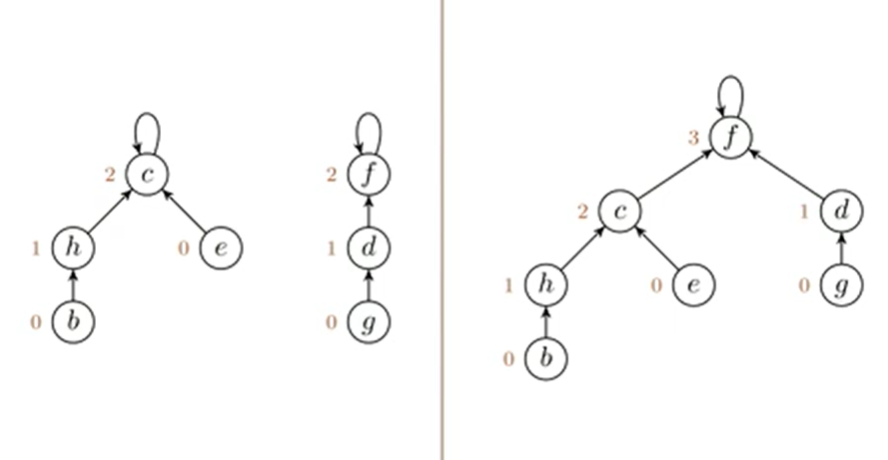

    første er før. andre er etter union.9

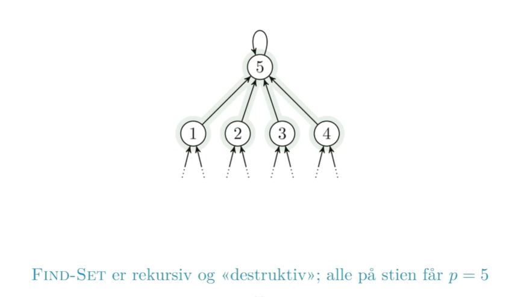

    find set har fantastisk kjøretid
    m operasjoner: O(m*a(n))
    vi har m sammenslåinger av mengder.
    m er antall kanter i spenntreet vårt.
    a(n)<=4

# Generisk MST

***Spanning tree* is a graph where you remove all the edges that you can with it still being connected.**

***Minimal spanning tree* is the spanning tree with the lowest weight of the spanning trees. 
this weight can be multiple things.**
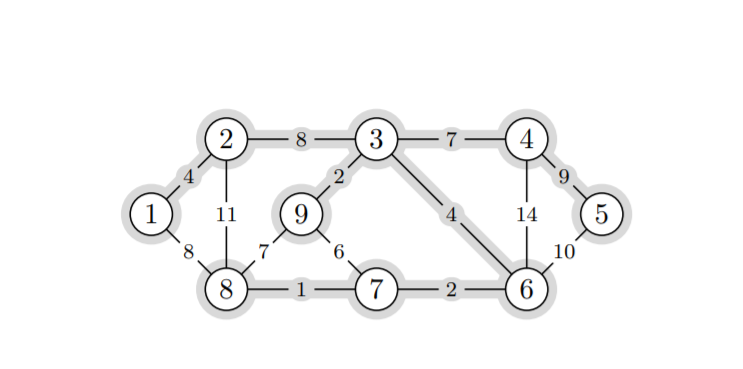
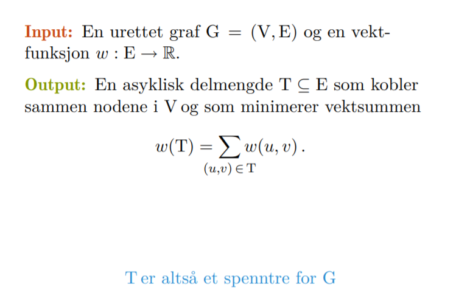

```python
def Generic_MST(G,w):
    A = 0
    while A does not form a spanning tree find an edge(u,v) that is safe for A 
        A = U{(u,v)}
    return A
```
>Vi utvider en kantmengde (partiell løsning) gradvis

>Invariant: Kantmengden utgjør en del av at minimalt spenntre

**En "Trygg kant" er en kant som bevarer invarianten.**

**En lett kant er en kant over snittet som gir minimal vekt over de kantene som er over snittet.**


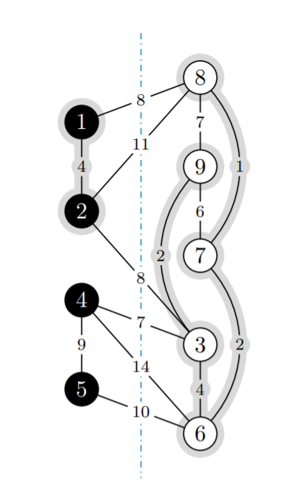

Exchange argument
- Ta en optimal løsning som ikke har valgt grådig
- Vis at vi kan endre til det grådige valget uten å få en dårligere løsning.

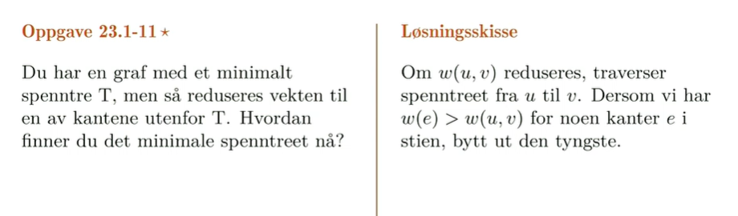

    Det som skjer her er at vi får en bro da over. Det vi da må teste er at vi må gå fra u til v og hvis vekten til en av de edgene er større enn den nye kanten så bytter vi den tyngste ut. 

# Kruskals algoritme
***En kant med minimal vekt blant de gjenværende er trygg så lenge den ikke danner sykler***

    Til å begynne med er hver node en komponent i en partiell løsning
    Komponenter: Disjunkte nodemengder. Starter med v.p = v
    Hver kant kobler sammen to komponenter til et større tre
    Vi kobler sammen komponentene ved å oppdatere v.p
    Tilsammen så kan v.p-pekerne utgjøre MST-et vårt . . .

>Én skog er fragmenter av et MST

>Den andre skogen: Disjoint-set forest

>Samme noder og komponenter

>Rettede kanter/pekere som spiller en helt
    annen rolle

>Vi behandler denne siste skogen som en
«black box» i algoritmen


```python
def MST_KRUSKAL(G,w):
    A = 0
    for each vertex v in G.V
        MAKE_SET(v)
    sort G.E by w
    for each edge (u,v) in G.E
        if FIND_SET(u)!= FIND_SET(v):
            A = A U{(u,v)}
            Union(u,v)
    return A
```    

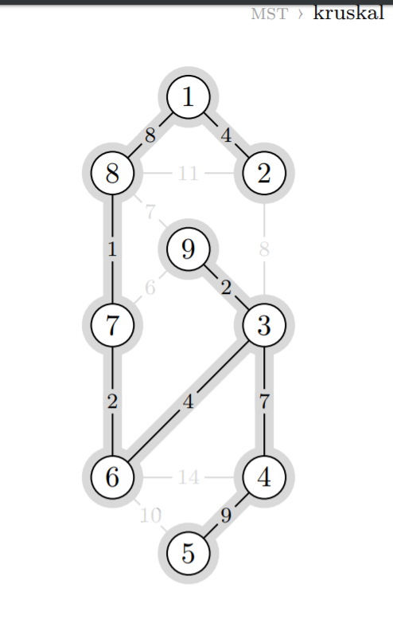


# Prims algoritme
***Prim bygger ett tre gradvis, enlett kant over snittet rundt treet er alltid trygg.***

    Kan implementeres vha. traversering
    Der BFS bruker FIFO og DFS bruker LIFO så bruker Prim en min-prioritets kø.
    prioriteten er vekten på den letteste kanten mellom noden og treet. 
    For enkelhetsskyld: legg alle noder inn fra starten, med uendelig dårlig prioritet. 

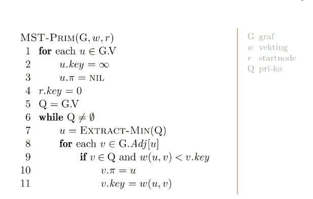

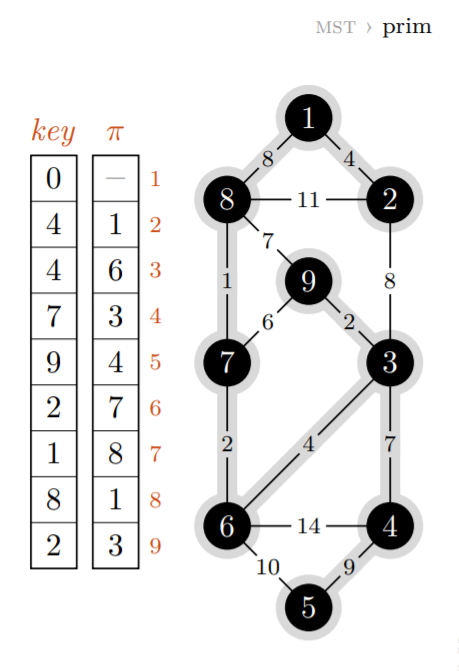

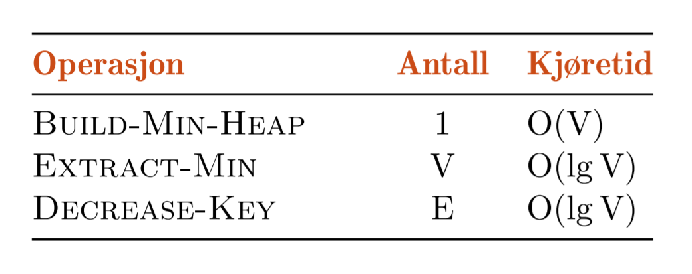
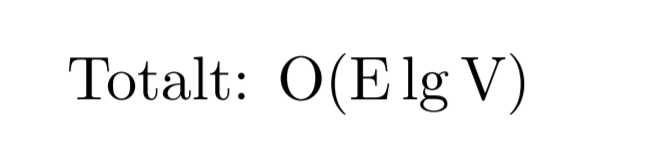

**Dette gjelder hvis vi bruker en binærhaug**


