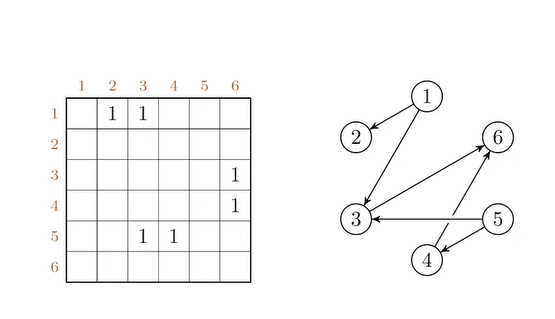
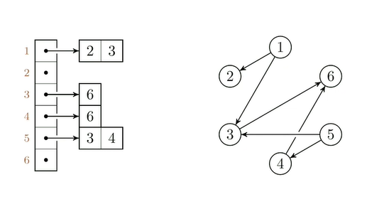
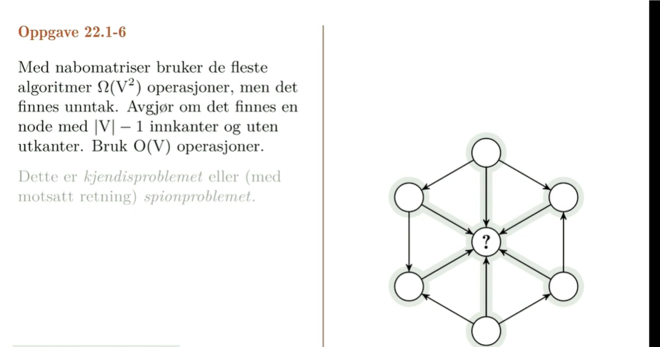
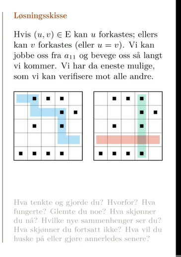
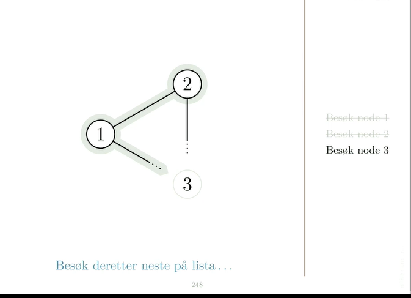

# **Traversering av grafer**

## Representasjon av grafer

   #### Nabomatrise
    Mer plass
    Må være kvadratisk i størrelse altså 6x6 etc.

    Det som skjer her er at vi går fra 1 til 2 som vi kan se. først på rad så kolonne. rettet graf så 2 1 er ikke aktivert.  

#### Naboliste
    mindre plass ofte.
**Nabolister: liste eller(tabell) med ut-naboer for hver node**

    kompakt, egnet til traversering; ikke så egnet til raske oppslag. 

    Ok så det som skjer er at alle de 6 nodene rundt den midterste vet hvem den midterste er, men den midterste vet ikke hvem noen av de utenfor er.
    vi vet at det tilsammen er 7 noder. Det vi gjør er å traverse på en måte slik at vi sjekker node1. deretter node2 osv.. helt til node6. 
    vi kan da se at alle nodene har noen inn og noen ut og at node7 har bare inn og ingen ut siden den ikke finnes i noen av de 6nodene. må ha en rad med bare 0 og en kolonne med bare 1. 
    Hvis 1 er kobla til 2 kan vi forkaste 1 siden final ikke skal ha noen utkanter.
    hvis 2 er ikke kobla til 4 kan vi forkaste 4 fordi final skal ha alle innkanter.  osv osv osv. 
    
    Det som vi gjør er hvis det står null i cella går vi til høyre. hvis det står 1 går vi ned. 
    Så hele poenget her man må skjønne handler om at hvis vi er i en node og ikke har en kant ut til en annen node vil det si at den andre noden mangler en kant inn og vi kan forkaste den. hvis vi derimot har en kant ut vil det si at vi har en utkant som ikke skal være og kan forkaste oss. 

#### Traversering generelt - vi besøker noder, oppdager noder langs kanter og vedlikelholder en huskeliste på noder vi har sett men ikke har besøkt enda. 

## Bredde først søk

**BFS: Naboer stille seg i kø. (vanlig kø, fifo ( first in first out))**

Sprer seg utover lagvis. 

    Her skjer det noe interessant i og med at vi først stter opp besøk node1.
    så gjør vi det
    deretter besøk node og besøk node 3.
    så kommer vi inn i node 2 og der ser v iat den er koblet til node3, men vi skriver ikke node3 opp igjen siden den allerede er der. 
## Dybde først søk

## Topologisk sortering

