# **Korteste vei fra en til alle** 

# Dekomponering

**Bryt ned i mindre instanser av samme problem, anta at vi kan løse dem siden vi løser dem rekursivt og bruk dem til å bygge et trinn i algoritmen.**
Hvis du skjønner det prinsippet har du kommet veldig langt.

**Skal bruke dette prinsippet til å finne kortest vei  i en graf.**

Vi har en start node og vi vil finne korteste vei til en annen node. **Oftest er det enklere å bare finne til alle.** Er en annen måte å se på dekomponering på. Istedenfor å se på en instans og bryte den ned til andre. Tar vi instansen og setter den i en familie med mange instanser og prøver å lage en sammenheng mellom dem så vi kan lage løsninger på hverandre. Lage et regneark med instanser med avhengighet mellom dem. 

**SSSP SINGLE SOURCE SHORTEST PATH: én til alle**

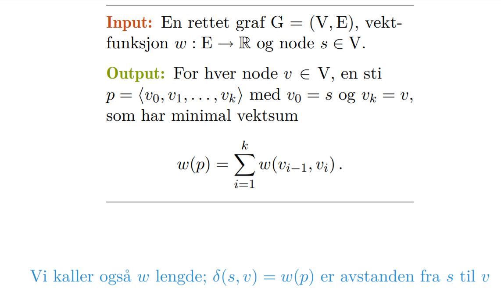

    Vi begynner med å anta en asyklisk graf
    Delproblemene er like nodene. 
    for å finne avstanden til den øverste noden er vi avhengige av å finne avstanden til de nodene under. 

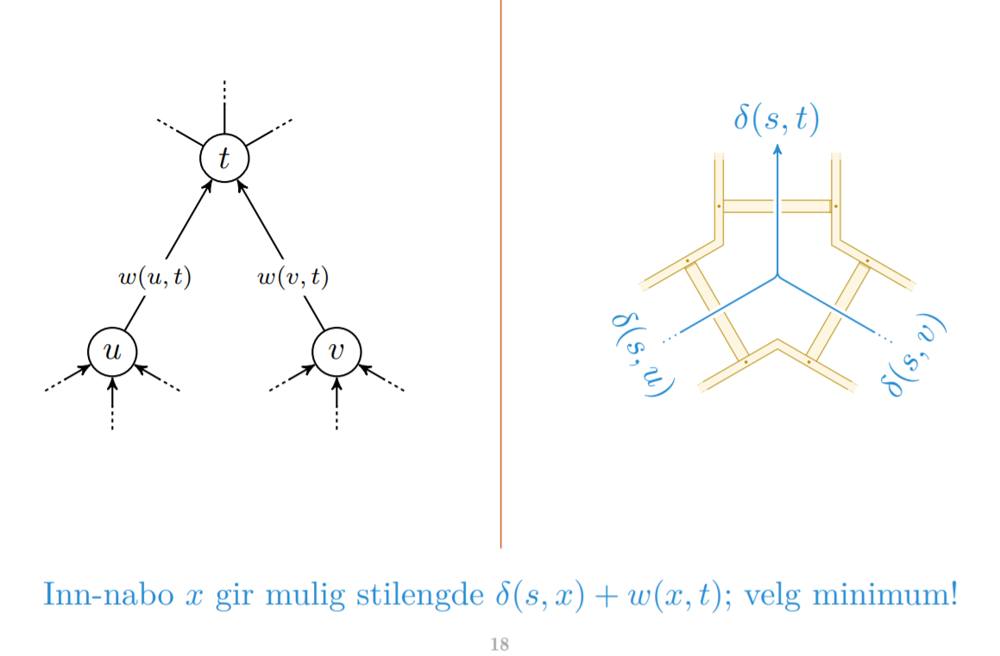

    Vi antar at vi har funnet o(s,-) for inn naboer induktivt. 

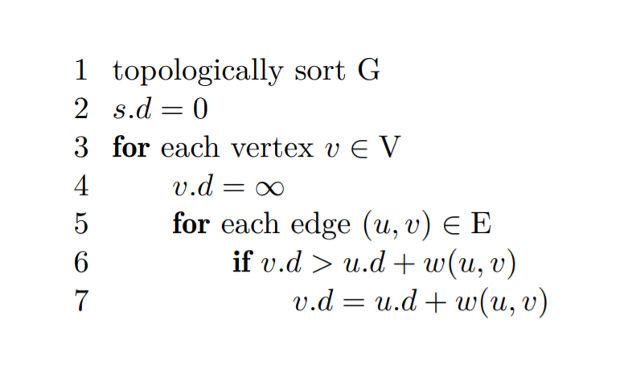

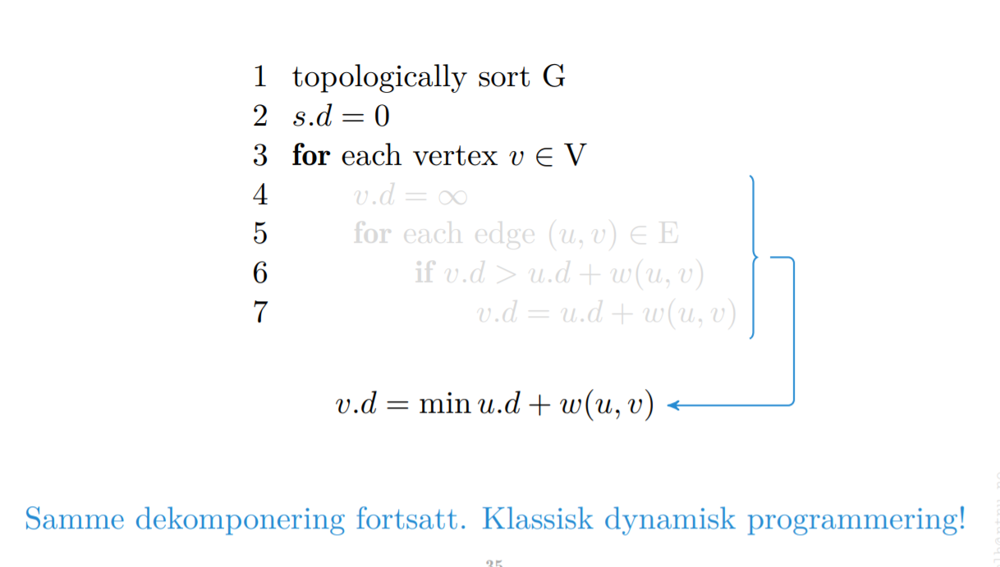

    For hver node gå gjennom forgjenger og se om man finner en snarvei. 
    Vi ser på forgjengere. Det vi vil ha er å se på etterkommerne fordi det er lettere å implementere. 

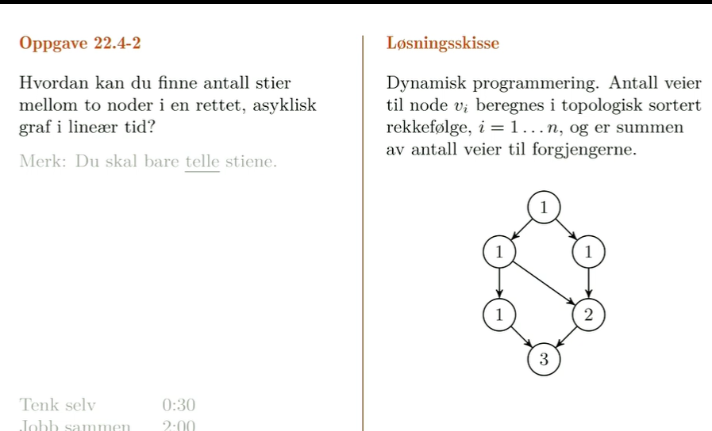

    Summen av størrelsen på grafen som er antall vertex og edges er kjøretiden asymptotisk. 
    
    Det vi kan gjøre er ok du går i startnode. så kjører du rekursjon. Går gjennom alle stiene med 
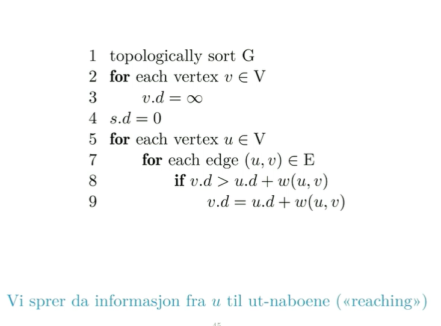

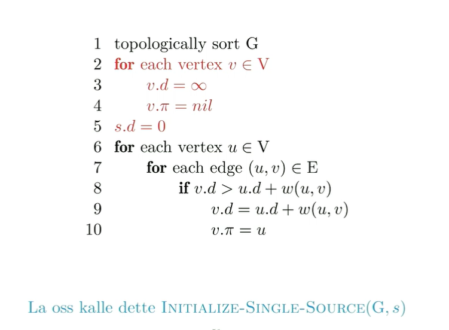

    den setter alle avstandene til uendelig utenom startnode som får 0 og alle forgjengere til null.

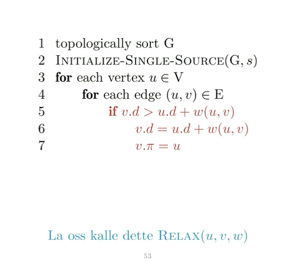

    Når vi har gjort det der med alle innkantene til en node har vi tatt minimum av forgjenger avstanden + kantvektene. Det her er en av dem og det er det vi kaller kantslakking / relax. 

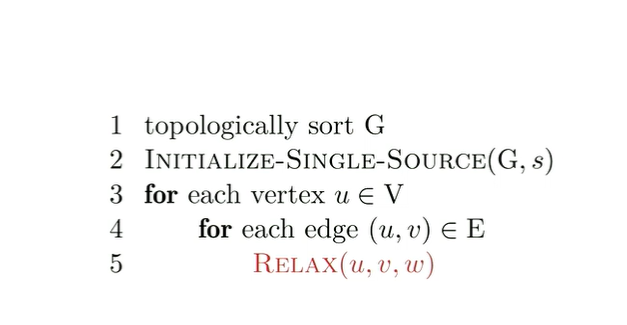

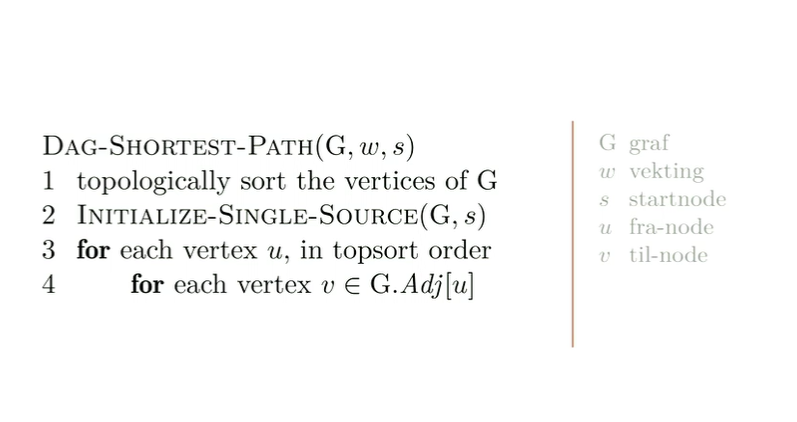

# DAG-Shortest-Path (DIRECTED ASYCLIC GRAPH)

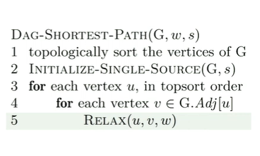

    start noden er 2.
    
# Kantslakking

# Bellman-Ford

# Dijkstras algoritme
