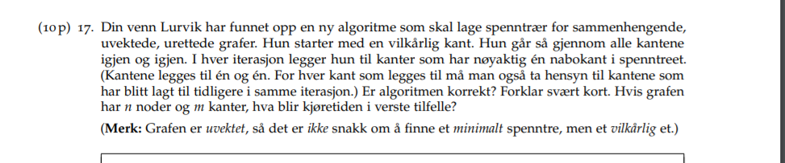
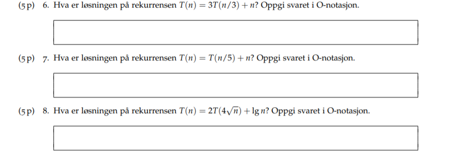
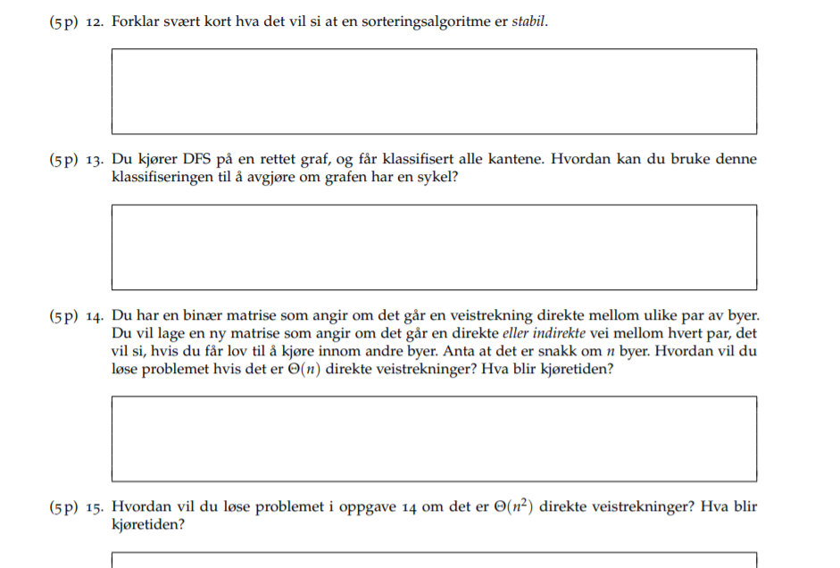
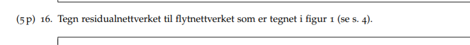
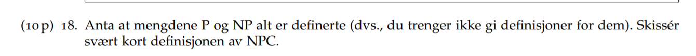
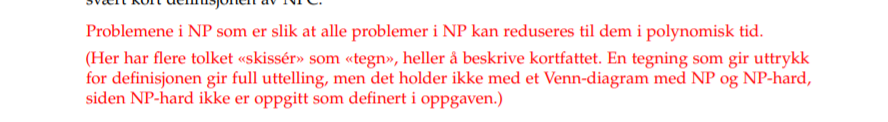
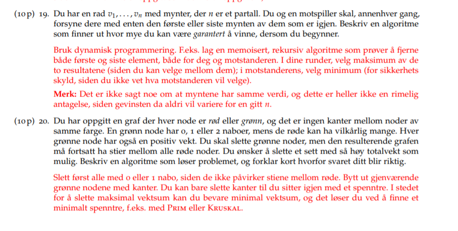

Refleksjon eksamen august 2016 
19.11.2016

DUO med Vegard / sepehr

Disse oppgavene er rett og slett bare å huske shit. Lær alle sorting algoritmene og egenskapene ved dem. Det er noen læringsmål som hører til hver forelesning som handler om å kunne kjøretid osv. 

Lær deg variabelskifte. Er bare å løse flere oppgaver så kan du det utenat.

Den første oppgaven er bare å sette opp binær haug / binærtre.

Når du har en liste med n og du kan løse oppgaven på en naiv måte som i dette tilfelle altså i O(n) kjøretid som du er ser med engang. tenk åp måter å løse det raskere på som er lgn. for å få lgn kan du egentlig bare en algoritme som er bisect / binærtsøk.

eneste måten å løse det på er å splitte nedover og gjøre konstant arbeid altså lgn.

Stabil bare å huske utenat. Det er at like elementer ikke blir flyttet på. 

Hvis du har en bakoverkant. Altså at du møter på en grånøde. Sjekk om det finnes bakoverkanter da. Altså at du møter på en grånøde. 

BFS eller DFS fra alle noder for å se hvem vi når. T(n) = O(n^2)

På neste kan man bruke transitive closure får O(n^3) eller så kan vi bruke bfs /dfs fra alle noder. 

Evt floyd warshall og se om avstandene blir endelige.

Residual nettverk er basic shit. lær deg flytnettverk basic shit.

fuck lurvik

Denne oppgaven er helt på trynet. Må være en hamilton sti for at svaret hans skal være rett. Helt fucka oppgve skjønner ikke en jackshit. 
kj;retiden blir theta(m^2)

Så den første oppgaven med mynter var litt hard, men svaret var ikke så jævlig vanskelig. Den får kjøretid på n^2 kanskje pseudopolonymsk but not realy.

Den siste oppgaven fik kdu egentlig ikke til, men det maka mye sense. 

