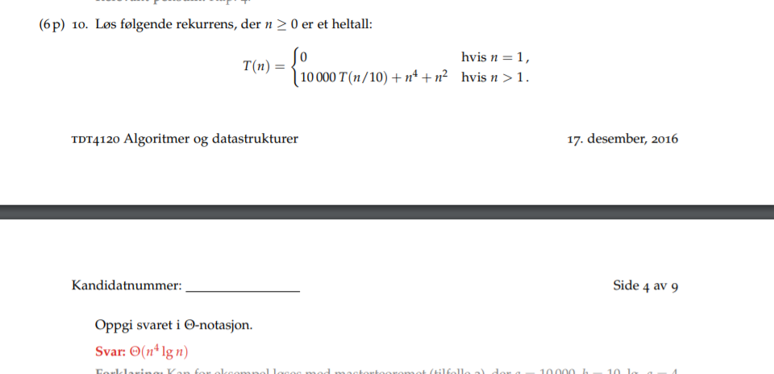

Refleksjon eksamen Desember 2016 
20.11.2016

DUO med Vegard / sepehr / patrick og amund

Første oppgave skjønte du bra.

andre oppgave så du at det  var en kø, men ikke nødvengrivis lifo kø. / stakk

Tredje oppgave ja dynamisk easy.

Denne så du med engang.
.

Den første skjønte du det har med at enten er det roten ellr så har den ikke blitt funnet. Hvis det er roten så har den avstand 0 hvis den ikk er funnet har den avstand uendelig

Andre oppgaven er det at vi må bare gå helt ned til bunne nav høyden altså O(h) som i dette tilfellet ikke nødvendigvis er logn

Amortisert du vet at det er O(1) konstant.

Bucket sort har constant på insertyion sort delen. OG du gjør det over n buckets så har du konstant på hver av dem.

Her er det divide and conquer basic.

masterteoremet siden 10 000 = n^4 som er større enn 10 og like stor som n^4 så får vi at den vokser og at den må telles med altså høyden på treet. og får n^4logn

Basic induction bro.

Les mer på bfs og dfs

Pugg transitive closure.

Bare kjør kruskal

Du finner denne stien ved å tegne sånn residualnettverk også følger du flowen.

Det den algoritmen gjør som er ford fulkerson er at så lenge man kan øke flyten til sluket så gjør den det. 

på dette punktet hadde du ikke lest bra nok på forelesning 12 og 13 spesielt.
helleri kke 11.

Denne burde du ha klart.

Dette her har du ikke lest på.

