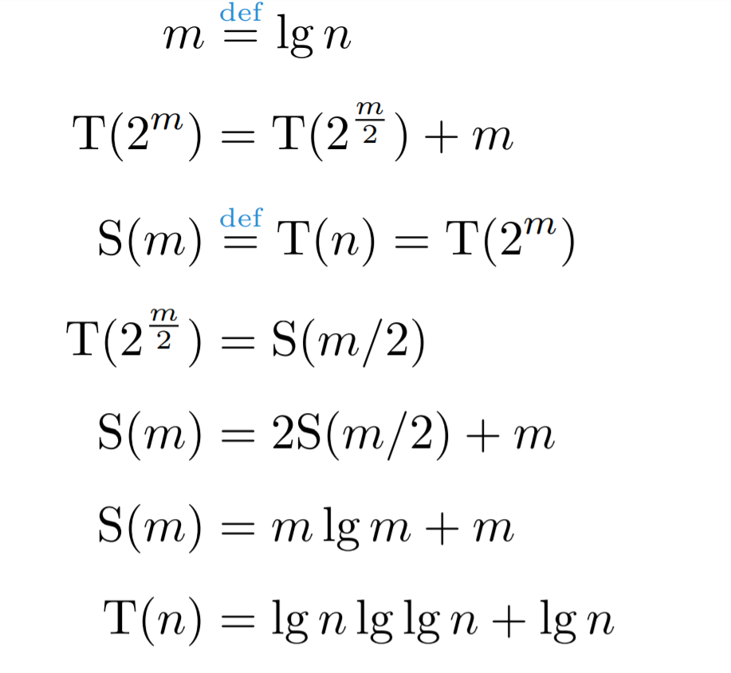
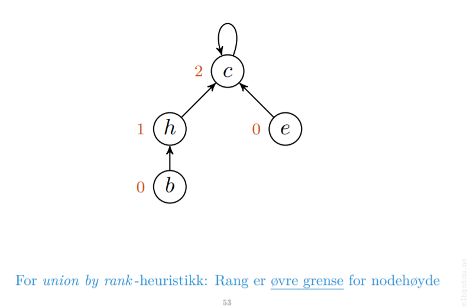
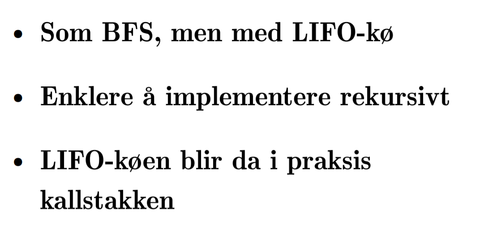
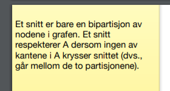
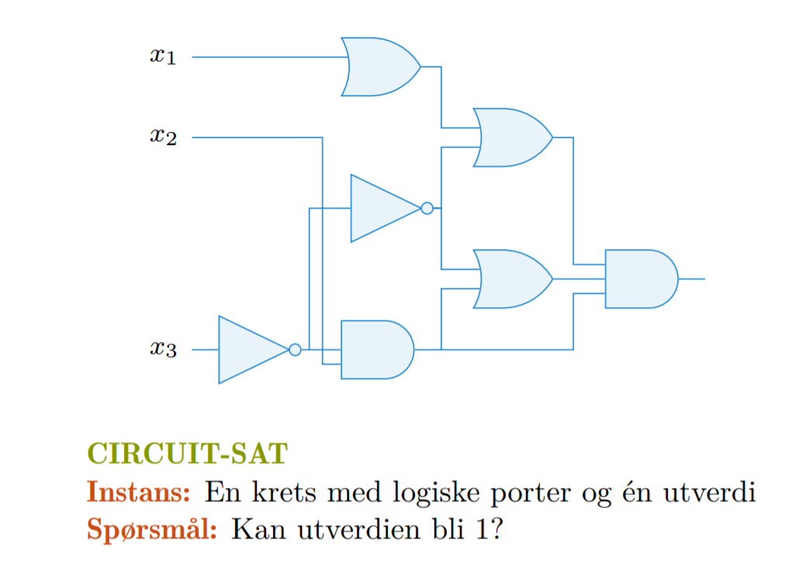
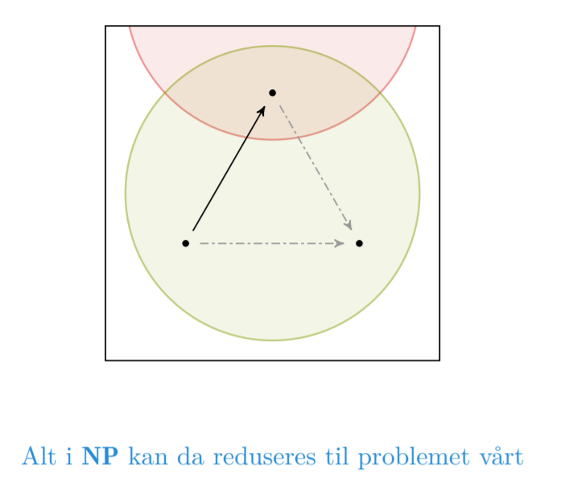

hvis vi vet vi ikke kan løse A og klarer å redusere B til A. vet vi også at vi ikke kan løse B fordi hvis vi løser B så kan vi bare redusere og deretter løse A også.

Mod ponens
B -> A

A<=B for å uttrykket at problemet A er redusibelt til B. det vil si at det finnes en reduksjon fra A til B så A kan løses ved hjelp av B. Det betyr altså at A ikke er vanskeligere enn B siden vi jo kan redusere til B; og ekvivalent at B er minst like vanskelig som A. 

P(A) 

----
all x P(x)

så P er true basert på basestep vi gjør den antagelsen

så sier vi Ok P => Q er sann.

javel da har vi P => Q og P for at P => Q skal være sann må Q også være sann

P => Q, P

-----
Q

Most hash functions assume that the universe of keys is the set N D f0; 1; 2; : : :g
of natural numbers. Thus, if the keys are not natural numbers, we find a way to
interpret them as natural numbers

key

h(k) = k mod 701 
Dette er en bra hashfunksjon for 

A prime not too close to an exact power of 2 is often a good choice for m. For
example, suppose we wish to allocate a hash table, with collisions resolved by
chaining, to hold roughly n = 2000 character strings, where a character has 8 bits.
We don’t mind examining an average of 3 elements in an unsuccessful search, and
so we allocate a hash table of size m = 701. We could choose m = 701 because
it is a prime near 2000/3 but not near any power of 2. Treating each key k as an integer, our hash function would be det over. 

Select bruker good partition og partition aroud. Den bruker select for å finne median for å finne beste splitt punkt og har worst case theta(n)

'

finish time blir en topologisk sortering.

Parentesteoremet - noder oppdages før og avsluttes etter sine etterkommere.

Topoloogisk sortering krever at grafen er en dag

Alle til en løses som single source shortest path bare i omvendt graf.

sykler er forbud med dag shortest path.

DIJKSTRA

Johnson

### Forelesning 13 - NP-kompletthet
 - [x] Forstå sammenhengen mellom optimerings- og beslutnings-problemer
   - Selv om L er språket som aksepteres av A, så trenger ikke A avgjøre L, siden den kan la være a svare for nei-instanser (ved å aldri terminere)
   - Den avviser x dersom A(x) = 0
   - Den avgjør et språk L dersom:
     - x ∈ L → A(x) = 1
     - x ∉ L → A(x) = 1
 - [x] Forstå koding (encoding) av en instans
 - [x] Forstå hvorfor løsningen vår på 0-1-ryggsekkproblemet ikke er polynomisk
   - DP-løsning har kjøretid *T(n, T) = Θ(nW)*
   - Encoding:
     - For enkelthetskyld, la oss si vi bruker Θ(n) bits på objektene. En rimelig encoding vil bruke Θ(m) bits på kapasiteten, *der m = lgW*
   - Polynomisk? **Nei!** Den må kunne skrives som *T(n, m) = Θ(n2ᵐ)*
 - [x] Forstå forskjellen på konkrete og abstrakte problemer
 - [x] Forstå representasjonen av beslutningsproblemer som formelle språk
 - [x] Forstå definisjonen av klassen P
   - Dette er språkene som kan avgøres i polynomisk tid.
   - Det er disse problemene vi kan løse i praksis. (Cobham's tese.)
 - [x] Forstå definisjonen av klassene NP og co-NP
   - Nondeterministic Polynomial Time
   - NP: Språkene som kan **verifiseres** i polynomisk tid.
     - HAM-CYCLE:
       - Språket for Hamilton-sykel-problemet.
       - HAM-CYCLE ∈ **NP**
       - Lett å verifisere i polynomisk tid. Ikke alltid like lett å falsifisere.
   - co-NP: Språkene som kan *falsifiseres* i polynomisk tid.
     - L ∈ **co-NP** ↔ L(overline) ∈ **NP**
     - Tautologi!
 - [x] Forstå redusibilitets-relasjonen ≤ₚ
   - Pensum ser på many-one-reduksjoner (Karp-reduksjoner).
   - Hvis A kan reduseres til B, skriver vi: `A ≤ₚ B`
   - `≤ₚ` er en preordning.
   - Hardhetsbevis:
     - Vise at B er vanskelig => Reduser fra et vanskelig prblem A => etabler `A ≤ₚ B`.
 - [x] Forstå definisjonen av NP-hardhet og NP-kompletthet
   - Kompletthet:
     - Et problem er komplett for en gitt klasse og en gitt type reduksjoner dersom det er maksimalt for redusibilitetsrelasjonen.
     - Dette er altså de vanskeligste i klassen **NP**.
   - Maksimalitet:
     - Et element er maksimalt dersom alle andre mindre eller lik.
     - For reduksjoner: Q er maksimalt dersom alle problemer i klassen kan reduserer til Q.
   - NPC:
     - De komplette språkene i NP, under polynomiske reduksjoner.
   - NP-hardhet:
     - Et problem Q er NP-hardt dersom alle problemer i NP kan reduseres til det.
     - Alle i NP-hard er altså way over alle i NP - og er ikke i NP.
     - NP-komplett (NPC) er samme problemer, men som finnes i NP.
 - [x] Forstå den konvensjonelle hypotesen om forholdet mellom P, NP og NPC
 - [x] Forstå hvorfor CIRCUIT-SAT er NP-komplett 
 - Notater:
   - Problem:
     - Generelt. Ex: Korstete vei.
   - Problemistans:
     - Instans av korsteste veien i Google Maps.
   - Hva er et beslutningsproblem:
     - Ja/Nei-svar.
     - Ex:
       - Spenntrær: Finnes det et spenntr i en gitt gra G som har vekt mindre enn eller like et gitt heltall K?
       - Korsteste vei: Finnes det en korsteste vei mellom to gitte node i en graf G som har vekt/avstand mindre enn eller like et gitt heltall K?
       - Travellting Salesman: Gitt en vektet graf G og et heltall K. Finnes det en sukel som besøker alle noder en gang og har total vekt mindre enn ...
   - Problemklasser:
     - Beslutningsproblemer som kan løses i polynomisk tid sier vi at tilhører P.
     - Polynomisk tid: O(n2ᵐ)
     - Beslutningsproblemer hvor en gikk løsning kan verifiseres i polynomisk tid sier vi at tilhører **NP**:
     - Verifisere: A sjekke om en gitt lønsning på et problem er en gyldig løsning av problemet.
     - Det store spm: Er elle problemene i NP også i P?
       - NP eksempel:
         - Vertex Cover
     - Uformelt sier vi at et gitt problem A er i klassen NPC hvis vi ved å løse A også kan løse alle andre problem i NP, samtidig som A selv er i NP.
     - Gitt et problem A i NP. Hvordan kan vi vise at A er i NPC?
       - Se fordet at vi har et annet problem B som vi **vet** er i NPC. Hvis vi klarer å vise at A er like vanskelig eller vanskeligere enn B, så vet vi at A også er i NPC.
       - Formelt betyr dette at om vi finner en polynomisk tid reduksjon fra B til A så har vi vist at A er i NPC
   - Problemet er i NP
   - Alle andre problem i NP kan reduseres til disse problemene i polynomisk tid.
   - Fra Clique til Independent Set.
     - Clique: Gitt en graf G og et heltall K. Finnes det en delmengde med noder i G av størrelse K hvor alle nodene er naboer?
     - Independent Set: Gitt en graf G og et heltall K. Finnes det en delmende med noder i G av størrelse K hvor ingen av nodene er naboer?
     - Vi vet: Clique er i NPC
     - Vi ønsker å finne ut: Er Independent Set i NPC?
       - Er Independent Set i NP?
       - Kan vi redusere Clique til Independent Set i polynomisk tid?

### Forelesning 14 - NP-komplette problemer
 - [x] Forstå hvordan NP-kompletthet kan bevises ved én reduksjon
 - [x] Kjenne de NP-komplette problemene CIRCUIT-SAT, SAT, 3-CNF-SAT, CLIQUE, VERTEX-COVER, HAM-CYCLE, TSP og SUBSET-SUM
   - *SUBSET SUM*
   - CIRCUIT-SAT
     - **Instans:** En krets med logiske porter og én utverdi
     - **Spørsmål:** Kan utverdien bli 1?
     - Vi har et vilkårlig språk/problem L ∈ NP
     - Vi vil redusere dette til CIRCUIT-SAT
     - Det eneste vi vet er at x ∈ L kan verifiseres i polynomisk tid
     - Vi simulerer trinnene i verifikasjonsalgoritmen A med kretser!
     - **Spørsmålet blir:** Kan A (for et eller annet sertifikat) svare/få en output på 1?
     - Eksempel:
       <pre>
       x ∈ {0, 1}\* => L er i NP, så ...
       Det finnes en pol. alg. A, som er slik at x ∈ L nøyaktig når minst én y ∈ {0, 1}\* gir A(x, y) = 1, der |y| = O(|x|ᶜ), for en eller annen c
       .
       \* ---> \* (A ---> B => Reduksjon <=> A? Da kan du jo bare B.)
       .
       ...
       .
       Er x med i språket L? <----> Kan utverdien bli 1?
       </pre>
   - SAT
     - **Instans:** En logisk formel
     - **Spørsmål:** Kan formelen være sann?
     - Direkte oversettelse av logisk krets?
     - Kan gi eksponentielt stor formel!
     - Eksempel:
       <pre>
       x1---------x5---|
       x2-------| . . .|--x8--|
       . . . . .|-x6>o-| . . .|
       . . . . .| . . .|--x9--|-x10-...
       x3--x4>o-|--x7--|------|
       .
       \* ----> \*
       .
       Ø = x10 ^ (x4 ⇔ ¬x3)
       . . . . ^ (x5 ⇔ (x1 v x2))
       . . . . ^ (x6 ⇔ ¬x4)
       . . . . ^ (x7 ⇔ (x1 ^ x2 ^ x4))
       . . . . ^ (x8 ⇔ (x5 v x6))
       . . . . ^ (x9 ⇔ (x6 v x7))
       . . . . ^ (x10 ⇔ (x7 ^ x8 ^ x9))
       .
       Kan utverdien bli 1? <----> Kan Ø være sann?
       </pre>
   - 3-CNF-SAT
     - **Instans:** En logisk formel på 3-CNF-form
     - F.eks.: Ø = (x1 v ¬x2 v x4) ^ ··· ^ (¬x7 v x8 v x9)
     - **Spørsmål:** Kan formelen være sann?
     - Vi kan bruke ca. samme reduksjon, på syntakstreet til Ø!
     - Vi får da en formel Ø' av pol. størrelse
     - Ø' er en konjunksjon av termer, hver med maks 3 literaler
     - Dvs.: de to argumentene, samt resultatet av operatoren
     - Hver term gjøres om til CNF vha. en sannhetstabell
     - (x v y) gjøres om til (x v y v z) ^ (x v y v ¬z)
     - Tilsv. blir (x) til fire nye termer
     - Eksempel:
       <pre>
       Ø' = y1 ^ (y1 ⇔ (y2 ^ ¬x2))
       . . . . ^ (y2 ⇔ (y3 v y4))
       . . . . ^ (y3 ⇔ (x1 ! x2))
       . . . . ^ (y4 ⇔ ¬y5)
       . . . . ^ (y5 ⇔ (y6 v x4))
       . . . . ^ (y6 ⇔ (¬x1 ⇔ x3))
       Ø'' = CNF, vha. sannhetstabeller
       Ø''' = 3-CNF, vha. dummy-variable
       .
       Kan Ø være sann? <----> Kan Ø''' være sann?
       </pre>
   - CLIQUE
     - **Instans:** En urettet graf G og et heltall k
     - **Spørsmål:** Har G en en komplett delgraf med k noder?
     - Vi vil redusere fra 3-CNF-SAT
     - Lag én node i G for hver literal i formelen
     - Ingen kanter mellom noder fra samme term
     - Ellers: Kanter mellom literaler som kan være sanne samtidig
     - La k være antall termer
     - Eksempel:
       <pre>
       Ø = ( x1 v¬x2 v¬x3 ) ^
       . . (¬x1 v x2 v x3 ) ^
       . . ( x1 v x2 v x3 )
       .
       Tilsvarer: x1, x2, x3 = -, 0, 1
       .
       Kan Ø være sann? <----> Finnes en k-klikk?
       </pre>
   - VERTEX-COVER
     - **Instans:** En urettet graf G og et heltall k
     - **Spørsmål:** Har G en et nodedekke med k noder? Dvs., k noder som tilsammen ligger inntil alle kantene
     - En klikk er en komplett delgraf
     - Tilsvarer en uavhengig mengde (kantfri delgraf) i komplementet !G = (V, !E)
     - Nodene utenfor en uavhengig mengde utgjør et nodedekke
     - Hvis G har en k-klikk . . .
     - . . . så har !G = (V, !E) en uavh. mengde med k noder ...
     - . . . og dermed også et (|V| - k)-nodedekke
     - Samme resonnement holder i motsatt retning
   - HAM-CYCLE
     - Vi reduserer VERTEX-COVER ≤ₚ HAM-CYCLE.
     - VERTEX-COVER dekker problemene HAM-CYCLE møter på da den skal bestemme den ene veien gjennom alle nodene.
   - TSP
     - Vi kan redusere HAM-CYCLE ≤ₚ TSP.
     - TSP er? korteste HAM-CYCLE.
 - [x] Forstå NP-kompletthetsbevisene for disse problemene
 - [x] Forstå at 0-1-ryggsekkproblemet er NP-hardt
 - [x] Forstå at lengste enkle-vei-problemet er NP-hardt
 - [x] Være i stand til å konstruere enkle NP-kompletthetsbevis 
 - Notater:
   - Q ∈ NPC ⇔
     - 1. ∀ L ∈ NP ⇒ **NP-hard (NPH)**
     - 2. Q ∈ NP

